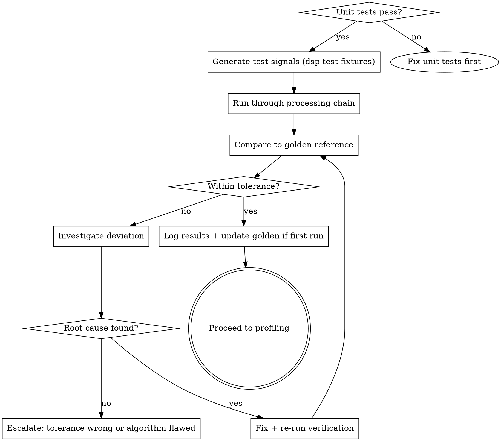

# Signal Processing Verification

## Overview

Unit tests verify code behaviour. Signal verification verifies signal correctness. Both are required -- neither alone is sufficient.

**Core principle:** Every DSP function must be verified against a known-correct reference before it ships. "Tests pass" is necessary but not sufficient.

**Violating the letter of this process is violating the spirit of signal integrity.**

## The Iron Law

```
NO DSP CODE SHIPS WITHOUT SIGNAL-LEVEL VERIFICATION
```

If you have not compared your output against a golden reference with documented tolerances, you cannot claim the implementation is correct.

## When to Use

**Always after:**
- Implementing any FFT, IFFT, or spectral processing function
- Implementing or modifying Goertzel detectors
- Implementing or modifying beat/onset detection
- Implementing or modifying any filter (FIR, IIR, biquad)
- Changing windowing, overlap, or hop size parameters
- Porting DSP code to fixed-point
- Changing sample rate, buffer size, or FFT size

**Do not skip when:**
- "Only changed a coefficient" -- coefficients ARE the algorithm
- "Tests pass" -- unit tests verify code flow, not signal correctness
- "Sounds right" -- ears are not measurement instruments

## Verification Types

### 1. Magnitude Accuracy (FFT / Spectral)

**Input:** Known single-tone or multi-tone signal from `/dsp-test-fixtures`
**Method:** Run through processing chain, compare output magnitude per bin to analytical expected values
**Tolerance:** Configurable, default +/- 0.1 dB for floating-point, +/- 1.0 dB for fixed-point
**Pass criteria:** All bins within tolerance

```python
def verify_fft_magnitude(output_bins, expected_bins, tolerance_db=0.1):
    """Compare FFT output magnitude against expected values.

    Args:
        output_bins: Complex FFT output array
        expected_bins: Expected magnitude array (linear or dB)
        tolerance_db: Maximum allowed deviation in dB

    Returns:
        (passed: bool, max_deviation_db: float, failing_bins: list)
    """
    output_mag_db = 20 * np.log10(np.abs(output_bins) + 1e-12)
    expected_db = 20 * np.log10(np.abs(expected_bins) + 1e-12)
    deviation = np.abs(output_mag_db - expected_db)
    failing = np.where(deviation > tolerance_db)[0]
    return len(failing) == 0, float(np.max(deviation)), failing.tolist()
```

### 2. Frequency Response (Filters)

**Input:** Impulse signal from `/dsp-test-fixtures`
**Method:** Pass impulse through filter, FFT the output, compare to design spec
**Tolerance:** Passband ripple, stopband attenuation, transition width per spec
**Pass criteria:** Response matches design within spec

### 3. Goertzel Detector Response

**Input:** Frequency sweep from `/dsp-test-fixtures`
**Method:** Run sweep through detector, measure response at target and off-target frequencies
**Tolerance:** Target detection > threshold, off-target < rejection floor
**Pass criteria:** Detection accuracy and selectivity meet spec

### 4. Beat/Onset Detection Accuracy

**Input:** Annotated click track from `/dsp-test-fixtures`
**Method:** Run through detector, compare detected events to annotations
**Metrics:** Precision, Recall, F-measure with tolerance window
**Pass criteria:** F-measure >= threshold (typically 0.85+)

```python
def verify_beat_detection(detected_times, reference_times, tolerance_ms=50):
    """Compare detected beat times against reference annotations.

    Args:
        detected_times: Array of detected beat times in seconds
        reference_times: Array of annotated beat times in seconds
        tolerance_ms: Window for matching in milliseconds

    Returns:
        (f_measure: float, precision: float, recall: float,
         false_positives: list, false_negatives: list)
    """
    tolerance_s = tolerance_ms / 1000.0
    matched = set()
    for det in detected_times:
        diffs = np.abs(reference_times - det)
        best = np.argmin(diffs)
        if diffs[best] <= tolerance_s and best not in matched:
            matched.add(best)

    tp = len(matched)
    fp = len(detected_times) - tp
    fn = len(reference_times) - tp
    precision = tp / (tp + fp) if (tp + fp) > 0 else 0
    recall = tp / (tp + fn) if (tp + fn) > 0 else 0
    f_measure = 2 * precision * recall / (precision + recall) if (precision + recall) > 0 else 0
    return f_measure, precision, recall
```

### 5. Fixed-Point vs Float Comparison

**Input:** Same test signal through both paths
**Method:** Run through float reference and fixed-point implementation, compare
**Tolerance:** Maximum ULP (Unit in Last Place) deviation, or dB deviation
**Pass criteria:** Deviation within acceptable range for application

## Process



## Golden Reference Management

- **Location:** `{{GOLDEN_DIR}}/` (configured in CLAUDE.md)
- **Format:** Raw binary (float32) or WAV for audio, JSON for metadata
- **Versioning:** Golden files are committed to git. Changes require review.
- **Updating:** Only update golden references when the algorithm intentionally changes. Never update to "make tests pass."
- **Metadata:** Every golden file has a companion `.json` with: generation date, generator parameters, expected tolerance, algorithm version.

## Red Flags -- STOP

- "Sounds close enough" -- measure, do not listen
- "Tolerance is too tight" -- justify loosening with analysis, do not just widen
- "Only off by a few bins" -- a few wrong bins means wrong algorithm
- "Works on my test signal" -- verify with the full fixture suite
- "Golden reference might be wrong" -- golden was verified when created; your code is more likely wrong
- Updating golden to make tests pass without understanding why output changed

## Integration

**Called after:** `/test-driven-development` (unit tests pass)
**Called before:** `/dsp-performance-profiling` (verify correctness before speed)
**Uses:** `/dsp-test-fixtures` for signal generation
**Pairs with:** `/audio-visualisation-debug` when investigating deviations
