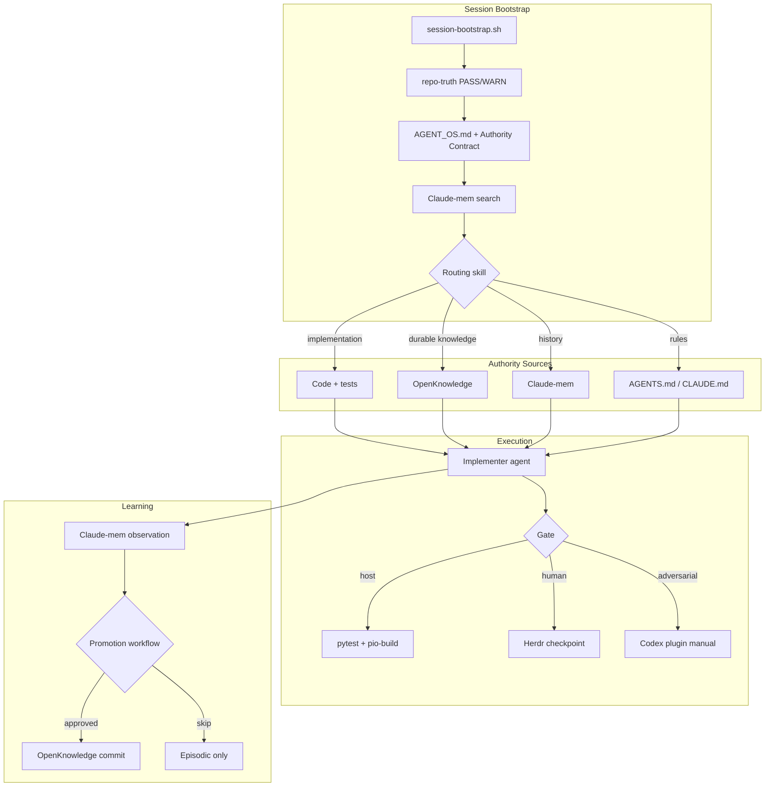

# Agent Stack — Swarm Orchestration Specification

**Status:** Adopted — standard stack v1 (2026-07-13); rollout phases 0–6 **DONE**  
**Authority:** [`AUTHORITY-CONTRACT.md`](./AUTHORITY-CONTRACT.md)  
**Tasks:** [`ACTIONABLE-TASKS.md`](./ACTIONABLE-TASKS.md)  
**Phases:** [`PHASED-ROLLOUT.md`](./PHASED-ROLLOUT.md)

---

## Purpose

Define how multiple agents coordinate end-to-end on SpectraSynq work **without authority collisions**. This spec covers roles, handoffs, Herdr layout, Ruflo pilot constraints, Codex plugin contracts, OpenKnowledge promotion, test scenarios, and per-phase success metrics.

---

## Design principles

1. **One owner per domain** — see authority contract; agents never merge episodic memory with curated knowledge automatically.
2. **Harness is the product** — firmware autonomy follows `autonomous-agentic-build` doctrine; agent-stack rollout is gated separately.
3. **Humans certify what agents cannot** — perceptual firmware quality, hardware flash, governance edits.
4. **Pilots are isolated** — Ruflo and Entire never run on production firmware lanes without explicit Captain scope.
5. **Promotion, not sync** — OpenKnowledge grows only through reviewed promotion.

---

## Agent roles and boundaries

| Role | Responsibility | May write | Must not |
|------|----------------|-----------|----------|
| **Orchestrator** | Phase gates, task dispatch, retry limits, swarm state | Planning docs, handoff bundles | Implement firmware; self-certify gates |
| **Implementer** | Code, config, tool install per scoped task | Source in lane scope | Change authority contract; enable forbidden tools |
| **Reviewer** | Adversarial review, PR critique, architecture challenge | Review comments, findings docs | Merge without gate; override Captain |
| **Tester** | Run pytest/PIO, execute test scenarios, capture evidence | Test logs, research docs | Flash device without approval |
| **Knowledge curator** | `knowledge/` structure, promotion, routing skills | OpenKnowledge Markdown, skills | Auto-import Claude-mem; stale `last_verified` |
| **Provenance auditor** | Config audits, forbidden-feature checks, sync pipeline hunts | Audit logs | Implement features |

### Collision rules

| Conflict | Resolution |
|----------|------------|
| Claude-mem vs OpenKnowledge | Memory = history; OK = curated. Promotion workflow bridges. |
| OpenKnowledge vs code | Code wins for behavior; OK wins for *documented intent* — if they differ, file a bug or update knowledge. |
| Ruflo vs Orchestrator | Ruflo dispatches lanes; Orchestrator owns gates. Ruflo does not merge. |
| Codex vs Claude Code | Codex receives **handoff bundles** only; no silent takeover. |
| Herdr vs any agent | Herdr observes; agents do not execute via Herdr. |

---

## End-to-end swarm workflow



---

## Herdr workspace layout

### One workspace per repository

| Workspace name | Herdr id | Repo path | Purpose |
|----------------|----------|-----------|---------|
| `SpectraSynq_K1_Firmware` | `w1` (2026-07-13) | `/Users/spectrasynq/SpectraSynq_K1_Firmware` | K1 firmware lanes, pytest/PIO gates |

Evidence: [`knowledge/research/phase1-herdr-proof.md`](../../knowledge/research/phase1-herdr-proof.md). Agents create/verify via `herdr workspace create` — not a Captain manual step.
| `spectrasynq-tab5` | *(future)* | Tab5 control client |
| `spectrasynq-knowledge` | *(optional central)* | Cross-repo knowledge PRs only if Captain wants |

### Herdr integration points

| Event | Herdr action |
|-------|--------------|
| Phase exit gate | Captain sign-off task visible |
| Firmware eyes-on gate | Human checkpoint scheduled |
| Ruflo eval complete | Scorecard review queue |
| Stuck agent (3 retries) | Escalation visible to Captain |
| OpenKnowledge promotion | Optional review queue for `status: verified` |

### Herdr is NOT

- An agent executor
- A memory store
- A git replacement
- Required for every agent session (visibility tool for Captain)

---

## Ruflo pilot specification

### Environment

```bash
# Isolated worktree — example
git worktree add ../SpectraSynq_K1_Firmware-ruflo-pilot -b pilot/ruflo-orchestration

cd ../SpectraSynq_K1_Firmware-ruflo-pilot
export RUFLO_DAEMON_AUTOSTART=0
npx ruflo@latest init --minimal --no-global
```

### Allowed

- Dispatch parallel implementer lanes
- Collect lane outputs for orchestrator merge decision
- Run 3 defined eval tasks (see below)

### Forbidden (provenance auditor verifies)

| Feature | Status |
|---------|--------|
| `RUFLO_DAEMON_AUTOSTART=1` | FORBIDDEN |
| `--dual` | FORBIDDEN |
| `--all-agents` | FORBIDDEN |
| CLI + marketplace together | FORBIDDEN |
| Ruflo memory / RAG | FORBIDDEN |
| SONA | FORBIDDEN |
| Instruction rewriting | FORBIDDEN |
| Federation | FORBIDDEN |
| Provider routing | FORBIDDEN |
| Background workers | FORBIDDEN |

### Three Ruflo eval tasks

#### Eval 1: Independent implementation lanes

| Lane | Scope example | Gate |
|------|---------------|------|
| Backend | Python test helper in `scripts/` | pytest |
| Frontend | Docs HTML in `artifacts/` | lint/render |
| Tests | New static gate test | pytest |

**Success:** All lanes green independently; orchestrator merges with post-merge pytest.

#### Eval 2: Cross-cutting defect investigation

- **Setup:** Inject or select a known flaky test scenario (host-only)
- **Dispatch:** 2+ agents with competing hypotheses
- **Rules:** Each cites code + Claude-mem; winner requires test proof
- **Success:** Root cause identified; single fix; no authority collision in write paths

#### Eval 3: Release preparation

Checklist lane:

1. Reviewer → PR comments
2. Tester → full pytest + PIO build
3. Knowledge curator → changelog + knowledge update
4. Provenance auditor → forbidden-tool scan
5. Orchestrator → readiness summary to Herdr

**Success:** Readiness doc complete; Captain checkpoint recorded.

### Ruflo metrics

| Metric | Target |
|--------|--------|
| Wall time vs manual orchestration | Measure; no target pre-pilot |
| Gate pass rate first attempt | ≥ manual baseline |
| Scope violations | 0 |
| Human escalations | ≤ manual baseline |

---

## Claude Code ↔ Codex handoff contract

### Via official plugin: `openai/codex-plugin-cc`

**Invocation:** Manual only — Captain or orchestrator triggers.

### Handoff bundle (required)

```markdown
## Codex Handoff Bundle

**Handoff ID:** <uuid>
**Type:** review | adversarial | rescue | transfer
**Repo:** SpectraSynq_K1_Firmware
**Branch:** <branch>
**HEAD:** <sha>

### Authority acknowledgment
- [ ] AGENT_OS.md safety rules apply
- [ ] No flash/upload without Captain approval
- [ ] Code/tests are implementation truth

### Scope
<exact files and task boundary>

### Context
- Lane summary: <1 paragraph>
- Claude-mem refs: <observation ids>
- OpenKnowledge refs: <paths>
- Failing evidence: <logs, test output>

### Deliverable
<what Codex must return>

### Return path
Codex output → Reviewer → Implementer merge → pytest + pio-build
```

### Handoff types

| Type | When | Codex deliverable |
|------|------|-------------------|
| **review** | Second opinion on design | Findings list; no direct merge |
| **adversarial** | Challenge implementation | Counter-examples, test gaps |
| **rescue** | Stuck lane | Patch proposal within scope |
| **transfer** | Cross-tool continuation | Status doc + partial implementation |

### Forbidden

- Auto stop-gate (Codex intercepts without bundle)
- Codex flash/upload
- Codex editing authority contract or gate scripts

---

## OpenKnowledge promotion workflow

**Non-negotiable:** Promotion to OpenKnowledge — **NOT** auto-sync from Claude-mem.

### Approval authority

| Step | Who | Requirement |
|------|-----|-------------|
| Draft | Agent or Captain | `status: draft` in frontmatter |
| Review | Reviewer agent **or** Captain | Evidence against code/tests; findings doc if adversarial |
| Verify | **Captain** **OR** delegated agent **only after** review gate PASS | Set `status: verified` + `last_verified` date; cite evidence artifact path |
| Commit | Knowledge curator | Manual git commit; no auto GitHub sync |

**Agents MUST NOT** self-set `status: verified` without a completed review gate and linked evidence artifact (research doc, PR review, or Captain sign-off). **No auto-sync** from Claude-mem, hooks, or MCP pipelines.

Delegated verification is allowed when Captain has explicitly delegated promotion authority for a scoped task; the delegating record must name the agent and evidence path.

### When to promote

- Architectural decision ratified by Captain
- Runbook proven across 2+ sessions
- Research conclusion with verified sources
- Recurring bug pattern with fix SHA

### When NOT to promote

- Session-specific debugging noise
- Unverified hypotheses
- Lane status (use git + progress.md with freshness rules)
- Duplicate of existing decision without new evidence

### Promotion steps

```
1. IDENTIFY  — Agent or Captain flags durable learning
2. DRAFT     — Knowledge curator creates Markdown in knowledge/ (status: draft)
3. FRONTMATTER — title, status: draft, sources (incl. claude-mem ids)
4. REVIEW    — Reviewer checks against code/tests; adversarial optional
5. VERIFY    — Captain OR delegated agent sets status: verified + last_verified (after review gate)
6. COMMIT    — Manual git commit; no auto GitHub sync (Phase 2)
7. RETRIEVE  — Routing skill test retrieval
```

### Frontmatter template

```yaml
---
title: <Decision title>
status: draft | verified | stale
last_verified: YYYY-MM-DD
sources:
  - claude-mem:<observation-id>
  - commit:<sha>
  - pr:<url>
owner: knowledge-curator
---
```

### Promote-learning skill (to author in Phase 3)

Location: `.cursor/skills/promote-learning/SKILL.md` and `.claude/skills/promote-learning/SKILL.md`

Minimum sections:

1. Promotion criteria checklist
2. Frontmatter requirements
3. Anti-patterns (auto-sync forbidden)
4. Link to routing skill

---

## Routing skill (minimal content)

Location: `.cursor/skills/knowledge-routing/SKILL.md` and `.claude/skills/knowledge-routing/SKILL.md`

```markdown
# Knowledge Routing

## Query: What is true right now?
→ git status, branch, HEAD, code, tests

## Query: What are the rules?
→ AGENT_OS.md, AGENTS.md, .claude/CLAUDE.md

## Query: What did we decide (durable)?
→ knowledge/decisions/ (check status + last_verified)

## Query: How do I operate X?
→ knowledge/runbooks/

## Query: What happened before?
→ claude-mem: search → timeline → get_observations

## Query: Who approved / human checkpoint?
→ Herdr + Captain

## Query: Second implementer or adversarial pass?
→ Codex plugin with handoff bundle (manual)

## Query: Parallel lanes?
→ Ruflo pilot worktree only (orchestration, Phase 4+)

## FORBIDDEN
- Treat claude-mem as current lane truth
- Auto-sync claude-mem → OpenKnowledge
- Use OmniRoute as primary gateway
- Use pxpipe
```

---

## Test scenarios (Phase 3 acceptance)

### Scenario 1: Fresh-agent handoff

| Field | Value |
|-------|-------|
| **Setup** | Promote a runbook for a scoped docs task; no Captain oral brief |
| **Agent** | New session, zero chat history |
| **Steps** | Bootstrap → routing skill → OpenKnowledge → complete task |
| **Pass** | Task complete; cites `knowledge/` paths; gate green |
| **Fail** | Captain re-brief required; wrong authority source used |

### Scenario 2: Old bug resurrection

| Field | Value |
|-------|-------|
| **Setup** | Known fixed bug with Claude-mem observations |
| **Agent** | New session |
| **Steps** | claude-mem search → read fix commit → verify code still contains fix |
| **Pass** | Correct fix identified; no false "still broken" |
| **Fail** | Missed mem entry; cited stale doc over code |

### Scenario 3: Architectural decision retrieval

| Field | Value |
|-------|-------|
| **Setup** | Decision in `knowledge/decisions/` with `status: verified` |
| **Agent** | New session |
| **Steps** | Routing skill → load decision → apply to implementation choice |
| **Pass** | Decision cited with `last_verified`; matches code policy |
| **Fail** | Used stale handoff.md; ignored frontmatter status |

---

## sqlite-utils operator recipes

Read-only snapshots for debugging agent state:

```bash
# Example: inspect a local SQLite DB (paths vary by install)
sqlite-utils tables /path/to/store.db
sqlite-utils query /path/to/store.db "SELECT * FROM observations ORDER BY id DESC LIMIT 10"
```

**Rules:**

- Read-only (`query`, `dump`, `tables`)
- No `insert`/`update` on agent production stores
- Document paths in `knowledge/runbooks/sqlite-snapshots.md`

---

## Entire CLI integration (Phase 4 pilot)

```bash
entire enable --agent claude-code --local --skip-push-sessions --telemetry=false
```

| Role | Boundary |
|------|----------|
| Entire | Session ↔ commit lineage in pilot repo |
| Git | Authoritative history |
| OpenKnowledge | Why decisions were made |
| Claude-mem | What was tried in session |

Agents log Entire checkpoint IDs in handoff bundles when pilot active.

---

## Success metrics per phase

| Phase | Metric | Target |
|-------|--------|--------|
| **0** | Contract ratified | 1 Captain sign-off |
| **1** | Herdr workspace live | 1 repo |
| **1** | Codex manual handoffs | ≥1 completed |
| **1** | Auto stop-gate incidents | 0 |
| **2** | Promoted decision docs | ≥3 with frontmatter |
| **2** | OpenKnowledge MCP uptime | Project-scoped queries succeed |
| **3** | Test scenarios passed | 3/3 |
| **3** | Auto-sync pipelines | 0 |
| **4** | Ruflo eval tasks | 3/3 scored |
| **4** | Ruflo scope violations | 0 |
| **4** | Entire remote pushes | 0 |
| **5** | Headroom quality review | 3/3 acceptable or no-go |
| **6** | Standard stack published | 1 manifest |

---

## Do-not list (from architecture review)

| # | Prohibition |
|---|-------------|
| 1 | Install or evaluate **pxpipe** |
| 2 | Use **OmniRoute** as primary provider gateway |
| 3 | Enable **Codex auto stop-gate** |
| 4 | **Auto-sync Claude-mem → OpenKnowledge** |
| 5 | Run **Ruflo full init** (`--dual`, `--all-agents`, daemon) |
| 6 | Use **Ruflo memory/RAG/SONA** during pilot |
| 7 | **Ruflo instruction rewriting** or federation |
| 8 | **Entire** `--skip-push-sessions` disabled or telemetry on without approval |
| 9 | Use **Headroom** for memory/learn/instruction writes/output shaping |
| 10 | Modify **production firmware** in agent-stack rollout tasks |
| 11 | **Flash/upload/erase** without Captain approval |
| 12 | Treat **OpenKnowledge** as override for git/code |
| 13 | **Global tool installs** that pollute operator environment without documentation |

---

## Orchestrator retry and escalation

Aligned with `autonomous-agentic-build` fleet governance:

| Event | Action |
|-------|--------|
| Task fails gate | Retry implementer (max 3) |
| 3 failures | Escalate to orchestrator for decomposition |
| Queue depth > N | Halt swarm; Captain via Herdr |
| Scope violation detected | Provenance auditor halt; tear down pilot config |
| Authority collision | Stop; document; curator resolves routing skill gap |

---

## Integration with existing repo rituals

| Ritual | Agent-stack addition |
|--------|---------------------|
| `session-bootstrap.sh` | Read authority contract if agent-stack phase ≥1 |
| `repo-truth.sh` | Unchanged — git truth still gates **firmware**; docs-only dual-track per [`knowledge/decisions/agent-stack-repo-truth-dual-track.md`](../../knowledge/decisions/agent-stack-repo-truth-dual-track.md) |
| Post-session report | Add `openknowledge_promoted`, `claude_mem_observations` |
| Pre-commit hook | Unchanged for firmware; knowledge commits follow docs policy |
| claude-mem hooks | Continue recording; never auto-feed OpenKnowledge |

---

## Changelog

| Date | Author | Change |
|------|--------|--------|
| 2026-07-13 | agent:cursor | Promotion approval tightened; dual-track repo-truth cross-link |
