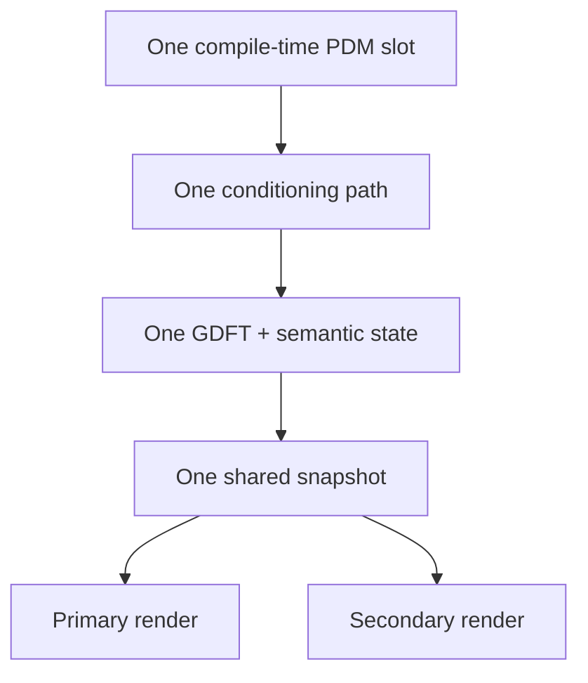
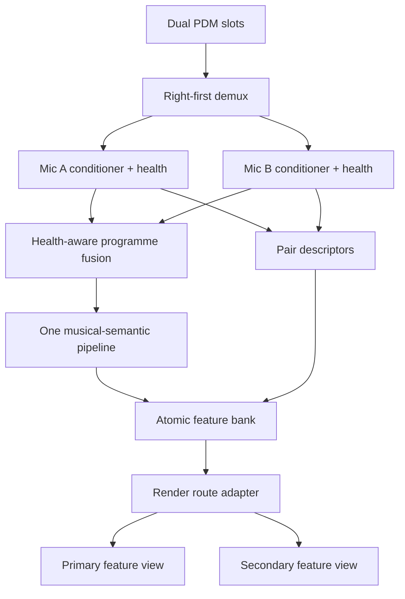

# K1 dual-IM69D130 stereo DSP decision

> Extracted from `/private/tmp/architecture-review-20260811-stereo-dsp.html` (SpectraSynq K1 · architecture review · 2026-08-11).

**SpectraSynq K1 · architecture review · 2026-08-11**

# Stereo is useful only when it becomes a better mono truth plus bounded spatial evidence.

**Decision selected**

One stereo capture. Two small mic conditioners. One shared musical-semantic pipeline. One coherent feature bank. Per-renderer feature views.

---

## Stance cards

### Adopt — Health-aware programme mono

Primary capsule with automatic healthy fallback; optional low-band fusion only after cancellation tests.

### Measure — Spatial descriptors

Balance, lagged coherence, health and a small side-energy cue. No programme-stereo claim.

### Defer — Beamforming / DOA

Conditional geometry gives 2.69 samples maximum ITD and spatial aliasing above 2.38 kHz.

### Reject — Two complete DSP stacks

CPU—not RAM—is the stop. A second GDFT/onset/tempo stack breaks the 7.5 ms AP envelope.

---

## Before · current source truth

Primary and secondary have independent visual state, but they do not have independent audio inputs. A secondary-only fault therefore sits downstream of shared audio until disproved.

## After · selected architecture

---

## Architecture candidates

### Depth, leverage and locality

The selected path creates three deep modules with small interfaces. It avoids a shallow flag surface spread across capture, effects, presets and transitions.

| Candidate | Value | Cost / risk | Decision |
| --- | --- | --- | --- |
| One full-band average | Simple, theoretical +3.01 dB ceiling | Direction-dependent comb cancellation; conceals failed mic | Reject |
| Health-aware programme mono | Robust existing DSP, immediate rollback | Requires per-mic health/calibration | Default |
| Low-band correlation-gated fusion | Possible noise benefit without high-band cancellation | Must beat best single mic and stay causal | Experiment |
| Two semantic pipelines | Maximum source independence | Adds 34,254 GDFT recurrences/frame plus onset and ACF | Reject |
| Feature bank + route adapter | Coherent frames, capture-independent effects, reusable seam | Requires disciplined migration from direct globals | Adopt |
| Beamforming / DOA | Could provide coarse one-axis confidence | Geometry, reverberation, aliasing and timing unproved | No-go now |

---

## Exact PDM transport

| Parameter | Value |
| --- | --- |
| Buffer order | R0,L0,R1,L1… |
| Read size | 384 B / 96 frames |
| PCM throughput | 51.2 kB/s |
| PDM clock | 1.6384 MHz |
| AP hop | 7.5 ms |

## Named render profiles

1. **SHARED_FUSED** — Both edges share the same musical truth. Independent visual state supplies composition.
2. **COMMON_BODY_SIDE_ACCENT** — Shared tempo, harmony and body; bounded side/coherence cue adds secondary texture.
3. **LOCAL_DYNAMICS_SHARED_SEMANTICS** — A/B dynamics may differ, while tempo and chord remain one scene-wide clock.
4. **DIAGNOSTIC_A_B** — Direct capsule routing is proof tooling only—not a product mode.

---

## Deployment blockers

## The software decision is made. Unit 2 stereo is not yet proved.

- Exact Unit 2 board, port coordinates and 72.08 mm applicability.
- Complementary SELECT voltages; “unused” is not an electrical state.
- Shared CLK/DATA continuity, dual power and non-contentious slot operation.
- Independent and simultaneous real-music liveness with reciprocal occlusion.
- Current Unit 2 + BLE Core-0 baseline over at least 100,000 AP frames.
- Causal audio-to-RMT/visible-light latency; host arithmetic is not proof.

---

Ten-agent SSA synthesis. No firmware implementation, flash, serial command, calibration or playback was performed in this architecture phase. Real-music-only law remains binding.
