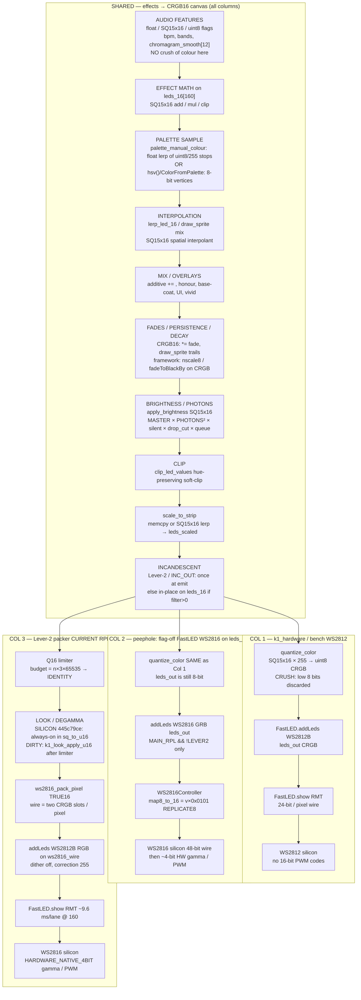

# VP 16-bit occupancy — orchestrator stage map

**Date:** 2026-08-21  
**Repo:** `/Users/spectrasynq/SpectraSynq_K1_Firmware`  
**Branch:** `feat/k1-scheduling-generation-hardening` @ `dc1e6991` (dirty Look Library)  
**Method:** READ-ONLY source synthesis. No firmware edits, no flash, no nested implementers.  
**Optical proof:** none. Host/source ≠ eyes-on.

Captain hypothesis under test (not closed): VP is 8-bit `CRGB` with a WS2816 16-bit serializer bolted on; most 16-bit codes never exist; a native RGB16 bypass renderer A/B is required before killing WS2816.

Skill `k1-ws2816-lever2` (do not contradict): K1 already renders in `CRGB16`; the 8-bit **wall** is `quantize_color()`; Lever-2 packs those 16-bit values. Occupancy asks a different question: which of the 65 536 wire codes are **authored**, which are **interpolants / decays of 8-bit vertices**, and which are **structurally unused**.

---

## 0. Silicon vs source (do not conflate)

| Layer | Identity | Emit | Look / degamma |
|---|---|---|---|
| **SILICON** (handoff) | Main RPL chip `9087A500`, USB `B4:3A:45:A5:87:90`, `/dev/cu.usbmodem1401` | `k1_main_rpl_im69d` @ **`445c79ce`** · Lever-2 explicit packer · dual-DIN 160 logical → 320 wire slots | **`K1_WS2816_DEGAMMA_V1` always-on** inside `k1_lever2_sq_to_u16` (packer `#ifdef`) |
| **SOURCE** (this dirty tree) | same env flags intended for next RPL flash | Lever-2 packer unchanged; look apply **after** Q16 limiter, **before** `ws2816_pack_pixel` | **`K1_LOOK_LIB_V1`** absorbs degamma as **slot 1**. Boot `CONFIG.LOOK=0` = identity (last night). Slot 1 = cube-spaced γ=2.2. Slot 2 = tungsten RGB 1D. Slot 3 = identity until a measured plate print exists. |
| **k1_hardware / bench WS2812** | F887 OFFSITE; B489 last stamped `k1_bench_im69d` | **No** `-DK1_WS2816_LEVER2_V1`, **no** `-DK1_LOOK_LIB_V1` | `quantize_color` → `CRGB leds_out[]` → 24-bit WS2812B wire |

On-disk crush map (call-site catalogue, **not current silicon**):  
`/Users/spectrasynq/Workspace_Management/Software/WS2816-Testbed/docs/eval/gate1/CRUSH_MAP.md` (written 2026-08-16). Line numbers for the **emit spine** have drifted; §3a–3d effect sites mostly have not. See §6.

Prior emit-path audit (transport, not occupancy): `docs/forensics/ws2816-degamma-audit-2026-08-18/S1-emit-path.md`. S1 correctly said Lever-2 **transport** can emit any u16. That does not prove live frames **occupy** those codes.

`CRGB16` comment in `constants.h:312` says “Unsigned Q8.8”. The type is `SQ15x16` = `SFixed<15,16>` (`int32_t`, 16 fractional bits). On `[0,1]` that is 65 537 representable states. Packer conversion is `(getInternal() * 65535) >> 16` because `SQ15x16` cannot hold 65535.

---

## 1. Three-column map (current source)

Shared prefix (all three columns) is Core 1 VP. Audio is Core 0. Secondary strip on Lever-2 RPL is the same packer (`show_secondary_leds` → `k1_lever2_pack_frame` on `ws2816_wire_secondary`). Framework LGP modes still compose on `CRGB*` then `toCrgb16` — that crush is **upstream of all three columns**.



Column 2 is a **compile-time peephole**, not a runtime switch. It exists only as `K1_MAIN_RPL_PINMAP_V1 && !K1_WS2816_LEVER2_V1` (`led_utilities.h` `init_leds` comment: “Flag-off bring-up: native FastLED WS2816 48-bit controllers”). **Not on silicon** (`445c79ce` defines Lever-2). Captain’s “bolted-on serializer” is this path: 8-bit `leds_out` fed to a 16-bit controller. Lost bits do not return.

---

## 2. Stage table — domain, bits, crush?, env, occupancy

**Occupancy legend**

| Tag | Meaning |
|---|---|
| **8-bit vertices** | Colour sourced from `uint8` (palette PROGMEM bytes, `CHSV`, `CRGB`, `ColorFromPalette`) |
| **16-bit interpolant** | SQ15x16 / float lerp **between** those vertices (spatial or palette-arc) |
| **16-bit decay** | Per-frame `*=` fade / energy envelope on `CRGB16` (geometric sequence in 16-frac) |
| **structurally zero low bytes** | `v<<8` expander (low byte always 0). **Not** what FastLED WS2816 does |
| **REPLICATE8 lattice** | `v×0x0101` = 256 codes `{0, 257, 514, …, 65535}`. Peephole + `crgb_to_crgb16`≈this |
| **TRUE16 occupied** | Packed u16 not on the REPLICATE8 lattice (interpolant, decay, look LUT, authored u16) |
| **structurally unused** | Codes the stage **cannot** emit even in principle |

| Stage | Domain | Bits | Crush? | Env | Occupancy |
|---|---|---|---|---|---|
| AUDIO FEATURES | `AudioSemanticState` / chromagram / GDFT | `float` + `SQ15x16 chromagram_smooth[12]` + `uint8` chord root | No colour crush | all | Not RGB. Energy envelopes are 16-frac **decay** once multiplied onto a colour |
| Effect mathematics | `leds_16[]` `CRGB16` | SQ15x16 add/mul | No, unless the mode wrote 8-bit first | all | Native modes: interpolant + decay. `hsv`/palette-8 / framework: **8-bit vertices** then upcast |
| Palette sample | `PaletteStopsHD` float cache **filled from `uint8/255`** | Stops: 8. Sample: float | Stop crush at unpack (`lightshow_modes.h:147–151`) | all | **8-bit vertices**. `palette_manual_colour` lerp is **16-bit interpolant along the palette polyline only** |
| `hsv()` / `CHSV` / `ColorFromPalette` | FastLED 8-bit | hue/sat 256 steps; `CRGB` out → `/255` into `CRGB16` | **YES** — vertices | waveform / VU / gdft / bloom / chromagram / kaleidoscope / framework | Low bytes of a **stop** are REPLICATE8-like, not a volume of u16 |
| Interpolation (`lerp_led_16`, `scale_to_strip` mismatch) | SQ15x16 | 16-frac | No | all | **16-bit interpolant** between whatever the neighbours already are |
| Mixing / overlays | SQ15x16 add | 16-frac | Soft-clip later | all | Sums of interpolants; still span the **polyline / additive cone** of 8-bit vertices, not RGB16 volume |
| Fades / persistence (`draw_sprite`) | SQ15x16 mix_left/right × alpha | 16-frac sub-pixel | No on CRGB16 path | CRGB16-native modes | **16-bit interpolant + decay**. Sub-pixel `position_fract` occupies codes between two pixels |
| Framework trail (`nscale8` / `fadeToBlackBy`) | `CRGB` uint8 | 8 | **YES** every frame | LGP framework | **8-bit vertices**; `toCrgb16` (`K1BufferView.h:58`) structurally fills REPLICATE8, not TRUE16 |
| Brightness / PHOTONS | SQ15x16 | 16-frac; knob is `float` then `PHOTONS²` (`PHOTONS_CURVE_MODE=0`) | No | all | **16-bit decay** of the whole frame. Does not invent new hues |
| Clip | SQ15x16 soft-clip | 16-frac | Magnitude crush above knee; hue ratio kept | all | Occupancy shrinks toward the gamut face, still not new vertices |
| `scale_to_strip` | SQ15x16 | 16-frac | No (160=160 is memcpy) | all | Identity at native 160. Else interpolant |
| Incandescent | SQ15x16 mix with `incandescent_lookup` `{1.0, 0.4453, 0.1562}` | 16-frac | Tint, not bit-depth | Col 1: skipped on Lever-2 / applied in-place if unflagged. Col 3: **once** at `sq_to_u16` | Scales existing codes; can knock a REPLICATE8 code **off** the lattice (TRUE16 from a tint) |
| `quantize_color` | → `CRGB` | **8** | **YES — the 8-bit wall** (`led_utilities.h:510–587`) | Col 1 + Col 2 only. Col 3 **skips** | After this: 256 codes/channel. Dither is 4-step noise for 8-bit LEDs, not low-byte content |
| Q16 limiter | u16 × Q16 | 16 | Identity today (`budget = n×3×65535`) | Col 3 | **structurally unused** as a crush. `s==65535` returns `ch` unchanged |
| Look / degamma | u16 → u16 | 16 | Remap, not a wall | **SILICON:** always-on in `sq_to_u16`. **DIRTY:** slot 0 identity / slot 1 shared 1D cube-spaced / slot 2 RGB 1D. After limiter, before pack | Slot 0: occupancy unchanged. Slot 1: **TRUE16 occupied** even from REPLICATE8 inputs (LUT y-nodes are not `n×257`). Host/source only |
| Packer | u16 × 3 → 6 bytes | 16 in, 48-bit GRB wire | No | Col 3 | Transport can emit any u16. Live occupancy is whatever arrived |
| FastLED.show / RMT | wire buffer | Col 1: 24-bit. Col 2/3: 48-bit | Col 2: FastLED may `scale16by8` if brightness/correction ≠ 255 | Col 3 forces correction/temperature 255, `DISABLE_DITHER` | Col 2 **REPLICATE8 lattice only**. Col 3 TRUE16 **if** upstream occupied it |
| WS2816 silicon | 16-bit codes → internal PWM | ~4-bit hardware gamma (`HARDWARE_NATIVE_4BIT`) | Transfer curve, not packer width. DAC is **not** claimed linear | Col 2 + Col 3 (WS2816 parts). Col 1 is WS2812 | PWM occupancy is silicon. **Not proven here.** `SOFTWARE_OUTPUT_GAMMA=OFF` (`ENABLE_OUTPUT_GAMMA=0`) |

`apply_gamma8` is pass-through (`constants.h:571, 607–612`). Ambient floor is compiled off (`ENABLE_AMBIENT_FLOOR=0`).

---

## 3. Column specifics

### Column 1 — `k1_hardware` / bench WS2812

```
leds_16 CRGB16 → apply_brightness → clip → scale_to_strip
  → quantize_color → leds_out CRGB → FastLED.addLeds<WS2812B>(leds_out)
  → FastLED.show() → 24-bit wire
```

- Env: `k1_hardware`, `k1_bench_reference`, `k1_bench_im69d` (no Lever-2).  
- `init_leds` uses `CONFIG.LED_TYPE` / `LED_NEOPIXEL` / `_X2` (`led_utilities.h:1429+`).  
- 16-bit working buffer is real. **Wire occupancy is 8-bit.** Extra interpolant/decay bits die at `quantize_color`.  
- This is the product WS2812 path. It does not answer the WS2816 occupancy question.

### Column 2 — peephole (`FastLED.addLeds<WS2816>(leds_out)`)

```
SAME quantize_color → leds_out CRGB
  → WS2816Controller loadAndScale_WS2816_HD
  → map8_to_16(v) = v * 0x0101
  → 48-bit wire, then WS2816 4-bit HW gamma
```

- Compile gate: `K1_MAIN_RPL_PINMAP_V1 && !K1_WS2816_LEVER2_V1` (`led_utilities.h:1422–1426`).  
- Public FastLED WS2816 API is **8-bit in**. Testbed contract: `WS2816-Testbed/docs/eval/SILICON_AND_TRANSPORT_CONTRACT.md` G0.4.  
- Occupancy: **256 codes/channel**, REPLICATE8, not structurally-zero-low-byte (`v<<8`).  
- Captain’s “serializer bolted onto 8-bit CRGB” **is this column**. Lever-2 exists because this column cannot recover discarded bits.  
- **Not on 9087 silicon.** Do not A/B this against Lever-2 by flashing unnamed units.

### Column 3 — Lever-2 explicit packer (current RPL)

```
leds_scaled CRGB16
  → skip quantize_color
  → incandescent-once in sq_to_u16
  → Q16 limiter (identity)
  → SILICON 445c79ce: degamma inside sq_to_u16
     DIRTY tree: k1_look_apply_u16(slot) after limiter
  → ws2816_pack_pixel TRUE16
  → FastLED.addLeds<WS2812B, RGB>(ws2816_wire)  // two slots / pixel
  → FastLED.show()
  → WS2816 silicon 4-bit HW gamma / PWM
```

- Env: `k1_main_rpl_im69d` only among ship-adjacent envs. Shippable `k1_hardware` / `k1_prod_im73d` / `k1_bench_reference` must **not** get this flag (skill freeze).  
- Dual-DIN: 160 logical × 2 wire slots; DIN-A / DIN-B each 160 slots = 80 physical WS2816.  
- Secondary: same packer (`led_utilities.h:2727–2755`).  
- Transport occupancy: **65 536 reachable** (S1). Live occupancy: **mode-dependent** (this audit’s open question).

---

## 4. Where 8-bit vertices still sit in front of a 16-bit packer

Lever-2 does not retune effects. Modes that already call `palette_manual_colour` keep 16-frac interpolants **between uint8 stops**. Modes that still call `hsv()` / `ColorFromPalette` / framework `CRGB` never author a 16-bit vertex.

**Already CRGB16-native** (`palette_manual_colour` + `finalize_additive_frame` / `draw_sprite`): comet, ember, ember_v2, tempo_river, tempo_river_walk, chroma_constellation, dense_forge, dense_forge_chord, spectrum_river, spectrum_river_v2, river_surge; waveform_* palette branches.

**Still 8-bit sourced** (CRUSH_MAP §3; `hsv()` lines on `waveform_fast.cpp` still 82, 94, 120, 132): waveform family, gdft, kaleidoscope, quantum_collapse, vu / vu_dot, bloom, chromagram_*. Extra vs 2026-08-16 map: `light_mode_wfhyb_k1_variants.cpp` (2 `hsv` sites). `interpolate_hue()` remains **defined and unused** by effects (`led_utilities.h:121` only).

**Framework:** `ZoneComposer.cpp:253` `nscale8` still before `toCrgb16` at `:187`. Trail `nscale8` / `fadeToBlackBy` still on CRGB in flux_rift / harmonic_tide / beat_prism.

---

## 5. Captain-proposed native RGB16 bypass vs what existing modes already exercise

Proposed A/B (ultra-slow, near-black, **before** any “kill WS2816” decision). Renderer authors **u16 vertices** (or `CRGB16` not derived from `uint8/255` stops), then uses the **same** Lever-2 packer. Compare eyes-on to current CRGB16-native modes on 9087.

| Stimulus | Existing CRGB16-native modes already exercise? | What they cannot |
|---|---|---|
| Ultra-slow near-black fade | **Partial.** `draw_sprite` / `*= fade` / energy envelopes are **16-bit decay** from a palette-sampled colour. Waveform-fast fade is SQ15x16 on `leds_16`. | Cannot **author** a vertex below `1/255` as paint. Fade from an 8-bit stop visits a 1D ray toward 0; it does not prove independent RGB16 darks (e.g. `R=0x0001, G=0, B=0` as a stop). Framework fades never leave 8-bit. |
| Colour crossfade | **Partial.** `palette_manual_colour` float-lerps **along the palette polyline**. Auto-shift walks that polyline. | Cannot crossfade two arbitrary RGB16 colours off the polyline. Stops remain `uint8`. Hue/sat from `hsv()` is 256-step. |
| Spatial gradient | **Yes, along the polyline.** Strip-index → palette `h` → float lerp between two uint8 stops. `scale_to_strip` / `draw_sprite` add spatial interpolants. | Cannot author a spatial ramp whose endpoints are not 8-bit stops (or interpolants of those stops). Independent R/G/B 16-bit ramps are not in the palette format (`TProgmemRGBGradientPalette_byte`). |
| Overlapping blooms | **Partial.** Additive `CRGB16` + `clamp_crgb16_preserve_sat` (ember, comet, dense_forge, bloom). Bloom colour itself is `hsv()` — 8-bit vertices with 16-bit **add**. | Cannot overlap two RGB16-authored blooms. Additive occupancy is a cone from 8-bit vertices, not a 16-bit colour volume. |
| Low-level audio decay | **Partial.** Chromagram / energy is `float`/`SQ15x16`; multiplied onto the sampled colour. That is 16-bit **magnitude** decay. | Chromatic vertex stays 8-bit (or polyline interpolant). Cannot decay an authored RGB16 note colour. `nscale8` trails in framework are 8-bit magnitude too. |

**Hypothesis restated without optical claim:** Lever-2 makes TRUE16 **transport** real. Live **occupancy** of codes off the REPLICATE8 lattice is (1) interpolants of uint8 palette stops, (2) SQ15x16 decays/adds of those, (3) incandescent tint, (4) on silicon 445c79ce the always-on degamma LUT. A native RGB16 bypass is the only way to occupy codes that are **not** in that set. Whether that occupancy is **visible on the LGP** is eyes-on, not this map.

Do not treat Palette HD V2 host PASS, look-library host tests, or this map as optical proof.

---

## 6. CRUSH_MAP line drift (update; map is not silicon)

File: `WS2816-Testbed/docs/eval/gate1/CRUSH_MAP.md` (2026-08-16). Emit spine in **this** tree (`led_utilities.h`):

| Crush-map claim | 2026-08-16 | 2026-08-21 dirty tree |
|---|---|---|
| `show_leds()` | :956 | **:1008** |
| `apply_brightness()` | :388 | **:436** |
| `clip_led_values` in brightness | cited :455 | clip fn **:257**; call at end of brightness **:507** |
| `scale_to_strip()` | :935, call :1061 | **:987**, call **:1132** |
| `quantize_color()` | :458 | **:510** |
| dither ON | :493–527 | **:531–579** |
| dither OFF | :529–534 | **:580–586** |
| `hsv()` | :147 | **:191** |
| `interpolate_hue()` | :73 | **:121** (still unused by effects) |
| `palette_manual_colour()` | lightshow_modes.h:228 | **:244** |
| `draw_sprite()` | :2420 | **:2420** (unchanged) |
| Lever-2 early return / `FastLED.show` | packer was proposed | **:1148–1207** pack + show + return |
| Flag-off `addLeds<WS2816>(leds_out)` | not in crush-map spine | **:1422–1426** |
| `show_secondary_leds()` | :2493 | **:2706** |
| `quantize_color_secondary()` | :2689 | **:2942** |
| §3a `hsv()` waveform_fast | 82, 94, 120, 132 | **unchanged** |
| §3d ZoneComposer `nscale8` | :253 | **unchanged** |
| §2 `toCrgb16` | K1BufferView.h:58–63, call ZoneComposer:187 | **unchanged** |

Do not edit CRUSH_MAP §3a–3d in this audit (skill E2 freeze). This table is the occupancy audit’s line-pin only.

---

## 7. Orchestrator verdict (12 lines)

1. Captain’s peephole is **real as Column 2** (`addLeds<WS2816>(leds_out)` after `quantize_color`); it is **not** what 9087 runs.  
2. Silicon `445c79ce` is **Column 3**: explicit TRUE16 packer + always-on degamma inside `sq_to_u16`.  
3. Dirty source is still Column 3, with degamma **demoted to look slot 1**; boot identity (slot 0) ≠ silicon always-on.  
4. `k1_hardware` remains Column 1 (8-bit wall, 24-bit wire).  
5. Skill stands: K1 **renders** in `CRGB16`; the wall is `quantize_color`; Lever-2 **packs** 16-bit.  
6. Occupancy does **not** stand as “65 536 codes exist in a live show”: palette stops are `uint8`; `hsv`/`ColorFromPalette`/framework `nscale8` are 8-bit vertices; interpolant + decay fill **rays and polylines**, not RGB16 volume.  
7. REPLICATE8 (`v×0x0101`) is the peephole lattice; structurally-zero low bytes (`v<<8`) are a different expander and are **not** FastLED WS2816.  
8. Existing CRGB16-native modes already exercise 16-bit **interpolant** and **decay** of 8-bit paint; they cannot author RGB16 vertices or off-polyline crossfades.  
9. Native RGB16 bypass A/B is the right next **experiment**, not a licence to implement in this pass.  
10. This map is host/source. It is **not** optical proof and **does not** close KEEP/KILL WS2816.

---

## 8. Ship path (this map does not close the occupancy / KEEP-or-KILL gate)

**Already promoted / on silicon / in source**

1. On silicon: Main RPL `9087A500` · `IDENTITY OK: git=445c79ce env=k1_main_rpl_im69d` · Lever-2 packer + `K1_WS2816_DEGAMMA_V1` always-on.  
2. In source (dirty, unflashed): `K1_LOOK_LIB_V1` on `k1_main_rpl_im69d` only; look apply after limiter; slot 0 identity / 1 degamma / 2 tungsten. Host look tests + `pio-build` k1_main_rpl_im69d / k1_hardware were GREEN in the prior look-library session; **not** flashed (`k1-flash-verified.sh` refuses dirty firmware).  
3. Product `k1_hardware` still Column 1; Lever-2 / look-lib must not leak there.

**Remaining numbered steps**

1. **Agent** — host occupancy histogram (packed u16, CRGB16-native vs `hsv` vs a **non-shipped** RGB16 stimulus generator). No flash. Evidence lands in this directory.  
2. **Captain** — if the dirty look-lib should be the A/B baseline, say **commit**; agent commits the look-library set only. Flash remains blocked until that commit.  
3. **Captain** — named **GO** for 9087 A/B of a native RGB16 bypass renderer (five stimuli). Do not GO “kill WS2816” first. F887 NO. B489 is WS2812 — do not copy the WS2816 print there.  
4. **Agent** — implement bypass **only after** that GO (not this session). Same Lever-2 packer; no `quantize_color`; no peephole `addLeds<WS2816>(leds_out)`.  
5. **Captain** — eyes-on the five stimuli vs current CRGB16-native modes.  
6. **Captain** — KEEP or KILL WS2816. Agent does not close that from source.

**Stamp that means shipped**

- **KEEP 16-bit / keep WS2816:** `IDENTITY OK: git=<bypass SHA> env=k1_main_rpl_im69d` on `9087A500` **and** Captain optical KEEP on the five stimuli (occupancy visible vs 8-bit vertices).  
- **KILL / park WS2816:** Captain KILL after that A/B, plus a named restore flash (`445c79ce` Lever-2+degamma, or Column 1 WS2812 env as specified). A source map is not that stamp.

No cal. No `start_noise_cal`. No I2S/LCD_CAM emit in this occupancy lane (parked).
