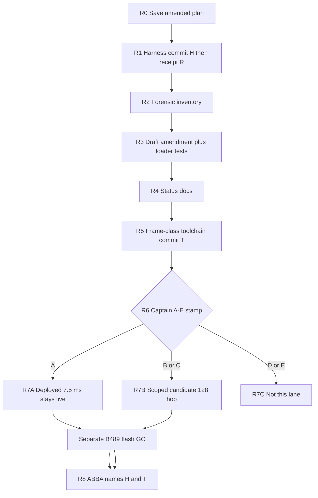

# G0R Cadence-Authority Reconciliation — Amended Execution Plan

> **Captain stamp A recorded 2026-08-16 AWST.** Deployed 12.8 kHz / 96 / d3 / 7.5 ms
> remains controlling. `TEN_MS_AP_HOP_AUTHORISED=NO`. Gate 2 stays red against 6 ms
> p99. Gate 3 blocked. B489 flash still HOLD until a **separate** GO. Do not treat
> this banner as flash authorisation.

> **For agentic workers:** REQUIRED SUB-SKILL: superpowers:executing-plans. Sequential single-agent implementation through R0–R5. Do **not** fan out parallel implementers. Steps use checkbox (`- [ ]`) syntax for tracking.
>
> **Do not execute the 13:38 draft.** Captain stamp: `PLAN_DIRECTION=PASS`, `EXECUTE_LITERAL_PLAN_AS_WRITTEN=NO`, `DISPOSITION=APPROVE_WITH_MANDATORY_AMENDMENTS`. Execution mode locked: `SEQUENTIAL_SINGLE_AGENT`.

**Goal:** Pin the current dirty Gate-2 measurement firmware as commit `H` (receipt `R`), reconcile the alleged 10 ms product decision against the frozen 7.5 ms deployed contract with a real contract-selection loader, then pin the final ABBA host toolchain as commit `T`. Flash nothing until Captain stamps A–E and issues a separate B489 GO.

**Architecture:** Split Gate 0: oracle machinery stays closed; product timing content reopens as `G0R`. Preserve [`gate0/contract.json`](docs/forensics/2026-08-15-freertos-scheduling-audit/gate0/contract.json) byte-for-byte as the **deployed** contract. A stamped 10 ms document, if any, is a **candidate-only** contract scoped to named probe envs. The production pointer does not move until Gate 8. Keep AP0/VP1. Reject priority, pacing, actorisation, Core-1 DSP. Gate 3 stays blocked.

**Tech Stack:** Host pytest, PlatformIO probe envs, [`k1_scheduling_gate0.py`](scripts/regression-harness/k1_scheduling_gate0.py), APCAD runner/comparator, frozen Gate-0 JSON.

**Spec:** Captain verdicts 2026-08-16 (progress report + this amendment) + [`EXECUTION_PLAN.md`](docs/forensics/2026-08-15-freertos-scheduling-audit/EXECUTION_PLAN.md) + [`HANDOVER_2026-08-15_SCHEDULING_HARDENING_IMPLEMENTATION.md`](docs/handover/HANDOVER_2026-08-15_SCHEDULING_HARDENING_IMPLEMENTATION.md) + [`gate0/contract.json`](docs/forensics/2026-08-15-freertos-scheduling-audit/gate0/contract.json).

## Captain stamp (binding)

```text
PLAN_DIRECTION                       = PASS
EXECUTE_LITERAL_PLAN_AS_WRITTEN      = NO
DISPOSITION                          = APPROVE_WITH_MANDATORY_AMENDMENTS

PIN_CURRENT_DIRTY_WORK               = GO_AFTER_COMMIT_GATE_FIX
G0R_FORENSIC_INVENTORY               = GO
G0R_DRAFT                            = GO_AFTER_SCHEMA_AND_LOADER_TEST_FIX
STATUS_DOC_CORRECTION                = GO
CAPTAIN_STAMP                        = HARD_STOP
B489_FLASH                           = HOLD
F887_FLASH                           = NO
G3_IMPLEMENTATION                    = BLOCKED
```

Approved through the **no-device G0R phase** (R0–R6). R7–R8 require the A–E stamp; R8 also requires a separate flash GO.

## Global constraints

- `AP0_VP1_TOPOLOGY = LOCK`
- `BROAD_RTOS_REWRITE = REJECTED`
- `G3_DEVICE_IMPLEMENTATION = BLOCKED`
- `F887_PRODUCTION_FLASH = NO`
- `B489_ABBA_FLASH_NOW = HOLD` until R6 stamp **and** matching candidate (if B/C) **and** explicit flash GO
- Do not overwrite `gate0/contract.json` in place
- `change threshold only = invalid`; `change actual timing tuple + rerun = valid`
- 96 samples / 7.5 ms is the AP hop, not the GDFT analysis window ([`k1_spectral_honesty.h`](SPECTRASYNQ_K1_FIRMWARE/audio/k1_spectral_honesty.h))
- Do not infer `10 ms approved ⇒ 24 kHz / 240 approved`
- Do not hide a 7.5 ms service deficit with a larger hop ([`EXECUTION_PLAN.md`](docs/forensics/2026-08-15-freertos-scheduling-audit/EXECUTION_PLAN.md) Gate 2)
- Firmware/`platformio.ini` commit gate is **full** `pytest tests/` then `k1_hardware` build ([`docs/git/commit-gate.md`](docs/git/commit-gate.md)). A focused subset is feedback only.
- Two pins, never one SHA for a later-mutated toolchain:
  - `HARNESS_FIRMWARE_PIN_SHA` = commit `H`
  - `FINAL_ABBA_TOOLCHAIN_PIN_SHA` = commit `T` after R5
- Receipt commit `R` identifies `H`; `R` is not the harness pin
- Unpaired 5 s dumps are **not** in `H` or `R`
- British English. No `start_noise_cal`. No upload/monitor tokens
- **Execution mode (locked):** sequential single agent through R0–R5. No parallel writes. A Code Reviewer may run **after** R2 and R3 artefacts exist, not concurrently with the implementer. Embedded-system-engineer only in R7B after the A–E stamp.

## Contract roles (do not collapse)

```text
DEPLOYED_CONTRACT
  current k1_hardware reality
  12.8 kHz / 96 / d3 / 7.5 ms
  file: gate0/contract.json
  remains globally selected until Gate 8

STAMPED_TARGET_CONTRACT
  Captain-authorised intended target after R6
  possibly 12.8 kHz / 128 / d2 or d3 / 10 ms
  may exist as a document before promotion
  must not masquerade as the deployed tuple

CANDIDATE_CAPTURE_CONTRACT
  exact contract for one named probe environment
  status=CAPTAIN_STAMPED
  scope=CANDIDATE_ONLY
  applicable_envs = the exact min/full pair for the stamped branch
  promotion_status=NOT_PRODUCTION
```

Every capture must attest and the oracle must reject mismatch:

```text
build_env
contract_id
firmware_sha
firmware_bin_sha256
actual_sample_rate_hz
actual_chunk_samples
actual_chunk_period_us
actual_tempo_decimation
```

## Authorised DAG

```text
R0  Amend and save the plan          (this document; docs only)
R1  Pin dirty firmware/harness       H then R; full pytest; no flash
R2  G0R forensic inventory           no contract mutation
R3  Draft G0R amendment              split rates; loader tests; deployed remains live
R4  Map-territory status docs
R5  Frame-class comparator           commit T; freeze perturbation limits
R6  Captain stamp A-E                HARD STOP
R7A If A: deployed stays active; G2 remains red; separate flash GO still required
R7B If B or C: scoped candidate contract + exact selected probe pair; production pointer unchanged
R7C If D or E: document the 10 ms surface; no production tuple change
R8  Device A-B-B-A                   after separate flash GO; names H and T; G3 blocked
```



---

### R0: Save the amended plan on disk

**Files:**
- Create: [`docs/superpowers/plans/2026-08-16-g0r-cadence-authority.md`](docs/superpowers/plans/2026-08-16-g0r-cadence-authority.md)

- [ ] **Step 1:** Copy this amended plan into that path. Do not copy the 13:38 draft.

- [ ] **Step 2:** Docs-only commit is allowed here (ungated). Do not bundle firmware. Header must state `EXECUTE_LITERAL_PLAN_AS_WRITTEN=NO` and that this file supersedes the 13:38 draft.

---

### R1: Pin current dirty firmware/harness (`H`) then receipt (`R`)

Two commits. `H` is the authoritative measurement-firmware pin. `R` is the evidence document that identifies `H`. Do not describe `R` as the harness pin. Do not claim one feature-branch SHA owns the later ABBA toolchain.

**Files in `H` (include):**
- [`SPECTRASYNQ_K1_FIRMWARE/SPECTRASYNQ_K1_FIRMWARE.ino`](SPECTRASYNQ_K1_FIRMWARE/SPECTRASYNQ_K1_FIRMWARE.ino)
- [`SPECTRASYNQ_K1_FIRMWARE/serial/k1_ap_capture_telemetry.h`](SPECTRASYNQ_K1_FIRMWARE/serial/k1_ap_capture_telemetry.h)
- [`SPECTRASYNQ_K1_FIRMWARE/serial/k1_ap_capture_telemetry.cpp`](SPECTRASYNQ_K1_FIRMWARE/serial/k1_ap_capture_telemetry.cpp)
- [`platformio.ini`](platformio.ini) — existing `k1_bench_scheduling_stage_min_probe` / `_full_probe` only
- [`scripts/platformio/k1_device_identities.json`](scripts/platformio/k1_device_identities.json) — B489 probe env names
- [`scripts/regression-harness/device_ap_cadence_capture.py`](scripts/regression-harness/device_ap_cadence_capture.py) — **initial** runner at `H`
- [`scripts/regression-harness/k1_stage_attribution_abba_compare.py`](scripts/regression-harness/k1_stage_attribution_abba_compare.py) — **initial** comparator at `H` (R5 will supersede this for Task R8)
- tests that already belong to that dirty set
- [`evidence/gate2-stage-attribution-implementation.md`](docs/forensics/2026-08-15-freertos-scheduling-audit/evidence/gate2-stage-attribution-implementation.md)
- [`scripts/agent/pio-build.sh`](scripts/agent/pio-build.sh) allowlist add for the two stage probe envs only

**Files in `R`:**
- Create: `docs/forensics/2026-08-15-freertos-scheduling-audit/evidence/gate2-harness-pin-receipt.md`
- Create: `tests/test_scheduling_harness_pin_receipt.py`

**Exclude from `H` and `R`:**
- `docs/forensics/runtime-evidence/20260816T-gate2-stage-attribution-781c40a9/` raw unpaired 5 s dumps
- `gate0/contract.json` edits
- Gate 3 firmware
- hop128 probe envs (those are R7B only)

**Interfaces:**
- Consumes: dirty tree; deployed 7.5 ms contract
- Produces: `HARNESS_FIRMWARE_PIN_SHA = H`; receipt `R` with `harness_commit_sha: H`

- [ ] **Step 1: Inventory**

```bash
git status --short
git diff --stat
git rev-parse HEAD
```

Classify every extra file as include-in-`H`, defer-to-R5, or exclude. Unpaired 5 s dumps: exclude.

- [ ] **Step 2: Extend pio-build.sh allowlist** with exactly:

```text
k1_bench_scheduling_stage_min_probe
k1_bench_scheduling_stage_full_probe
```

No upload tokens. No GDFT-cross/lane4/hop128 envs in this commit.

- [ ] **Step 3: Focused pytest (feedback only)**

```bash
pytest -q \
  tests/test_k1_stage_attribution_abba_compare.py \
  tests/test_scheduling_stage_attribution.py \
  tests/test_scheduling_stage_perturbation_pair.py \
  tests/test_scheduling_ap_cadence_parser.py \
  tests/test_k1_av_regression_static.py \
  tests/test_dev_instrumentation_boundary.py
```

Record as `focused_pytest_result`. This **cannot** authorise the commit.

- [ ] **Step 4: Full commit gate**

```bash
pytest tests/ -q
bash scripts/agent/pio-build.sh k1_hardware
bash scripts/agent/pio-build.sh k1_bench_scheduling_stage_min_probe
bash scripts/agent/pio-build.sh k1_bench_scheduling_stage_full_probe
```

Record as `full_pytest_result` plus the three build results. No commit if full pytest is red.

- [ ] **Step 5: Binary and source hashes for the receipt (computed against the tree that will become `H`)**

```bash
shasum -a 256 \
  .pio/build/k1_hardware/firmware.bin \
  .pio/build/k1_bench_scheduling_stage_min_probe/firmware.bin \
  .pio/build/k1_bench_scheduling_stage_full_probe/firmware.bin \
  platformio.ini \
  scripts/regression-harness/device_ap_cadence_capture.py \
  scripts/regression-harness/k1_stage_attribution_abba_compare.py
```

- [ ] **Step 6: Commit `H`** — firmware/harness only, **no receipt file**. Message:

```text
test: pin Gate-2 min/full measurement firmware

Non-shipping measurement checkpoint H. Deployed 7.5 ms Gate 0 contract
remains controlling. Does not close Gate 2, start Gate 3, or authorise flash.
Initial host runner/comparator at this SHA will be superseded for ABBA by
toolchain pin T after frame-class work.
```

- [ ] **Step 7: Write receipt against `H` (not against itself)**

Receipt fields:

```text
harness_commit_sha: <H>
receipt_commit_sha: SELF_NOT_EMBEDDED
parent_of_harness_sha
firmware_bin_sha256.k1_hardware
firmware_bin_sha256.k1_bench_scheduling_stage_min_probe
firmware_bin_sha256.k1_bench_scheduling_stage_full_probe
platformio_ini_sha256
capture_runner_sha256          # at H
initial_comparator_sha256      # at H; not the ABBA pin
contract_id_still_controlling: K1_SCHEDULING_GATE0_2026_08_15
production_tuple_at_H: 12800/96/d3/7500
admissible_as: MEASUREMENT_HARNESS_PIN_NOT_G2_CLOSE
B489_ABBA_FLASH_NOW: HOLD_FOR_G0R
focused_pytest_result
full_pytest_result
excluded_unpaired_5s_pack:
  path
  size
  sha256
  capture_classification
  reason_excluded_from_Gate-2_proof
```

A small generated **summary** of the 5 s pack may be committed in `R` if useful. The raw logs must not.

- [ ] **Step 8: Receipt integrity tests (write failing first)**

```python
def test_receipt_identifies_harness_commit_not_itself():
    receipt = load_receipt()
    h = receipt["harness_commit_sha"]
    assert receipt["receipt_commit_sha"] == "SELF_NOT_EMBEDDED"
    assert is_ancestor(h, "HEAD")

def test_pinned_paths_at_H_match_receipt_hashes():
    h = load_receipt()["harness_commit_sha"]
    for path, field in PINNED_PATHS:
        blob = git_show(f"{h}:{path}")
        assert sha256(blob) == load_receipt()[field]

def test_named_probe_envs_exist_at_H():
    ini = git_show(f"{h}:platformio.ini")
    assert "[env:k1_bench_scheduling_stage_min_probe]" in ini
    assert "[env:k1_bench_scheduling_stage_full_probe]" in ini

def test_production_tuple_at_H_is_still_96_d3():
    cfg = git_show(f"{h}:SPECTRASYNQ_K1_FIRMWARE/system/config_types.h")
    assert "DEFAULT_SAMPLES_PER_CHUNK 96" in cfg or "DEFAULT_SAMPLES_PER_CHUNK=96" in cfg
    contract = json.loads(git_show(f"{h}:docs/forensics/2026-08-15-freertos-scheduling-audit/gate0/contract.json"))
    assert contract["production_tuple"]["samples_per_chunk"] == 96
    assert contract["production_tuple"]["ap_arrival_period_us"] == 7500
```

After `R` lands, `HEAD` is `R` and `H` is its parent (or ancestor if docs intervene). Tests must use the receipt's `harness_commit_sha`, not `HEAD`.

- [ ] **Step 9: Commit `R`** (docs + the receipt test). Message:

```text
docs: identify Gate-2 harness pin H

Receipt R records harness_commit_sha and hashes. R is not the measurement pin.
```

- [ ] **Step 10: Stop.** No flash. `_service_check` 7.5 ms literals stay until R5 parameterises them from the **deployed** contract object (still 7.5 ms), not from a 10 ms target.

---

### R2: G0R forensic inventory (no contract mutation)

**Files:**
- Create: `docs/forensics/2026-08-15-freertos-scheduling-audit/evidence/g0r-cadence-authority-inventory.md`

On-disk facts that must appear (do not rediscover from memory):

- Deployed tuple: 12800 / 96 / d3 / 7500 µs; p99 fraction 0.8 ⇒ 6000 µs
- VP target 120 FPS
- hop_n vs spectral_window_n in [`k1_spectral_honesty.h`](SPECTRASYNQ_K1_FIRMWARE/audio/k1_spectral_honesty.h)
- June probe `12.8k/128/d2` ~100.040 Hz AP / ~50.007 Hz NOV and `16k/160/d2` ~100.027 / ~50.003, explicitly **not** the next move ([`2026-06-06-ap0-vp1-implementation-handover.md`](docs/forensics/tempo_tracking_refactor/2026-06-06-ap0-vp1-implementation-handover.md) §7)
- [`ssa2-cadence.md`](docs/forensics/im69d-bringup-2026-08-06/ssa2-cadence.md): 128/d2 silently retunes `K1V2_MEDIAN_WIN` and onset alphas unless rebound
- `calculate_novelty()`, onset, and semantic snapshot run every AP iteration; tempo heavy path is decimated (`K1_NOVELTY_DECIMATION` in [`k1_tempo.cpp`](SPECTRASYNQ_K1_FIRMWARE/audio/k1_tempo.cpp))

Required inventory fields per hit:

```text
hit_id
path
sha_or_date
verbatim_quote
surface_class = I2S_DMA_HOP | AP_SEMANTIC_PERIOD | DSP_ANALYSIS_WINDOW | ACTIVE_WORK_BUDGET | VP_FRAME_BUDGET | PROBE_CANDIDATE | STALE_PROSE | UNKNOWN
product_vs_probe = PRODUCT_DECISION | PROBE_CANDIDATE | STALE_PROSE | UNCLEAR
binds_sample_rate / binds_chunk_samples / binds_tempo_decimation
captain_speech_act = APPROVED | CANDIDATE | REJECTED | UNSTATED
admissible_as_g0r_authority = yes/no
```

- [ ] **Step 1:** Search `docs/`, handover, `gate0/`, `EXECUTION_PLAN.md`, `progress.md`, `spec-index.md`, `CLAUDE.md` for `10 ms`, `100 Hz`, `12800/128`, `16000/160`, `24000/240`, `semantic hop`.

- [ ] **Step 2:** `git log -S` on `contract.json` `samples_per_chunk` and `DEFAULT_SAMPLES_PER_CHUNK`.

- [ ] **Step 3:** Optional mem-search (`cadence`, `100Hz`, `10ms`, `Gate0`). On-disk wins.

- [ ] **Step 4:** Red-team: June probe pass ≠ product approval; VP 100 FPS prose ≠ AP 100 Hz; GDFT window ≠ hop; sub-8 ms latency ≠ AP period; 16 kHz/160 and 24 kHz/240 not implied.

- [ ] **Step 5:** Commit inventory docs. Do not edit `contract.json`.

---

### R3: Draft G0R amendment + real loader-selection tests

**Files:**
- Create: `docs/forensics/2026-08-15-freertos-scheduling-audit/gate0/amendments/G0R_2026-08-16.draft.json`
- Create: `docs/forensics/2026-08-15-freertos-scheduling-audit/evidence/g0r-cadence-authority-amendment.md`
- Modify: [`scripts/regression-harness/k1_scheduling_gate0.py`](scripts/regression-harness/k1_scheduling_gate0.py) — add `select_contract(...)`; do **not** change `DEFAULT_CONTRACT` away from `contract.json`
- Modify: [`tests/test_scheduling_gate0.py`](tests/test_scheduling_gate0.py)
- Create fixture tree under `tests/fixtures/scheduling_gate0/g0r_selection/` (tmp-style committed fixtures): `contract.json` copy or pointer-to-real, `amendments/draft.json`, `amendments/stamped_candidate.json`, `pointers/none`, `pointers/draft`, `pointers/stamped_wrong_env`, `pointers/stamped_matching_env`

**Rate schema in the draft** (do not set `NOVELTY_UPDATE_RATE_HZ = 44.444`):

```text
AP_ACQUISITION_RATE_HZ
GDFT_INVOCATION_RATE_HZ
SPECTRAL_FLUX_CALC_RATE_HZ
ONSET_UPDATE_RATE_HZ
SEMANTIC_PUBLICATION_RATE_HZ
TEMPO_NOVELTY_INGEST_RATE_HZ
TEMPO_HEAVY_UPDATE_RATE_HZ
TEMPO_PUBLICATION_RATE_HZ
AP_HEAVY_DSP_INVOCATION_PERIOD_US
```

Current-implementation **old** values to confirm by reading source in this task, then write:

```text
AP acquisition             = 133.333 Hz
GDFT                        = 133.333 Hz
spectral flux calculation  = 133.333 Hz
onset update               = 133.333 Hz
audio semantic publication = 133.333 Hz
tempo novelty ingest/heavy = 44.444 Hz
tempo publication          = from actual k1_tempo.cpp semantics (cheap republish vs heavy emit); do not guess 44.444
```

Do **not** auto-derive `AP_ACTIVE_P99_TARGET_US` from `AP_SEMANTIC_PERIOD_US` unless the contract explicitly binds GDFT and the complete heavy AP transaction to execute once per semantic period. Record that binding as a boolean:

```text
HEAVY_AP_TRANSACTION_ONCE_PER_SEMANTIC_PERIOD = true | false
```

If false, service p99 has its own named period (`AP_HEAVY_DSP_INVOCATION_PERIOD_US`).

Draft amendment `status` starts `DRAFT_AWAITING_CAPTAIN`. All `fields.new` stay `null` unless R2 found a product speech-act. June numbers go in `probe_candidates[]`, not `fields.new`.

Include the deployed/candidate distinction in the draft schema even while unstamped:

```json
{
  "schema_version": 1,
  "amendment_id": "G0R_2026_08_16",
  "status": "DRAFT_AWAITING_CAPTAIN",
  "supersedes_contract_id": "K1_SCHEDULING_GATE0_2026_08_15",
  "old_contract_path": "docs/forensics/2026-08-15-freertos-scheduling-audit/gate0/contract.json",
  "old_contract_sha256": "VERIFY_WITH_SHASUM",
  "deployed_contract_role": "DEPLOYED_CONTRACT",
  "stamped_target_role": "PENDING",
  "candidate_scope": {
    "status": "NOT_STAMPED",
    "scope": "CANDIDATE_ONLY",
    "applicable_envs": [],
    "promotion_status": "NOT_PRODUCTION"
  }
}
```

**Loader API to implement and test** (tests must call this, not merely `json.loads` two files):

```python
@dataclass(frozen=True)
class ContractSelection:
    selected_contract_path: Path
    selected_contract_id: str
    selected_contract_sha256: str
    selected_period_us: int
    selected_p99_limit_us: int
    selection_reason: str
    scope: str  # DEPLOYED | CANDIDATE_ONLY

def select_contract(
    root: Path,
    *,
    pointer_path: Path | None = None,
    build_env: str | None = None,
    measured_tuple: dict[str, Any] | None = None,
) -> ContractSelection:
    ...
```

Selection rules:

1. Draft file may exist. If **no pointer** (or pointer absent): select original `contract.json` (7.5 ms). Reason: `no_pointer_deployed_contract`.
2. Pointer targets `DRAFT_AWAITING_CAPTAIN`: **fail closed**.
3. Pointer targets `CAPTAIN_STAMPED` with `scope=CANDIDATE_ONLY` but `build_env` not in `applicable_envs`, or measured tuple mismatches: **fail closed**.
4. Pointer targets `CAPTAIN_STAMPED`, `scope=CANDIDATE_ONLY`, env in `applicable_envs`, measured tuple matches: accept candidate. Reason: `candidate_env_and_tuple_match`.
5. Pointer targets a production promotion (`promotion_status=PRODUCTION`): **not implemented in R3**. Fail closed with `production_promotion_not_authorised_before_gate8`. Live repo must not contain this pointer.

Live `DEFAULT_CONTRACT` and CLI `--contract` default remain the original 7.5 ms file. Do not add a live `active_contract_pointer.json` in R3 that points at the draft.

- [ ] **Step 1: Write failing loader tests**

```python
def test_draft_exists_no_pointer_selects_deployed_75ms(oracle, tmp_path):
    sel = oracle.select_contract(tmp_path, pointer_path=None, build_env="k1_hardware")
    assert sel.selected_contract_id == "K1_SCHEDULING_GATE0_2026_08_15"
    assert sel.selected_period_us == 7500
    assert sel.selected_p99_limit_us == 6000
    assert sel.selection_reason == "no_pointer_deployed_contract"

def test_pointer_to_draft_fails_closed(oracle, g0r_fixtures):
    with pytest.raises(oracle.Gate0Error, match="DRAFT_AWAITING_CAPTAIN"):
        oracle.select_contract(..., pointer_path=g0r_fixtures / "pointers/draft")

def test_stamped_candidate_wrong_env_fails_closed(oracle, g0r_fixtures):
    with pytest.raises(oracle.Gate0Error, match="applicable_envs"):
        oracle.select_contract(..., pointer_path=stamped, build_env="k1_hardware",
                               measured_tuple=TUPLE_96)

def test_stamped_candidate_matching_env_and_tuple_accepted(oracle, g0r_fixtures):
    sel = oracle.select_contract(..., pointer_path=stamped,
                                 build_env="k1_bench_scheduling_hop128_d2_min_probe",
                                 measured_tuple=TUPLE_128_D2)
    assert sel.scope == "CANDIDATE_ONLY"
    assert sel.selected_period_us == 10000
```

Each assertion must use `ContractSelection` fields: path, id, sha256, period, p99, reason.

- [ ] **Step 2:** Run `pytest tests/test_scheduling_gate0.py -k select_contract -v` — expect FAIL (`select_contract` missing).

- [ ] **Step 3:** Implement `select_contract`. Keep `validate_run` using the contract object the caller passes. After R3, `validate_run` must still reject attested-tuple mismatch if evidence contains a tuple (add that check if not present; today it compares evidence tuple to the passed contract).

- [ ] **Step 4:** Write the draft JSON + markdown. Confirm `TEMPO_PUBLICATION_RATE_HZ` from source.

- [ ] **Step 5:**

```bash
pytest tests/test_scheduling_gate0.py -q
```

Live oracle still 7.5 ms. Trust-root hash of `contract.json` unchanged.

- [ ] **Step 6:** Commit scripts/tests/docs (pytest tier). No firmware.

---

### R4: Map–territory status documents

**Files:**
- [`docs/spec-index.md`](docs/spec-index.md) — Active Lanes still says `Gate 0 ACTIVE`; replace
- [`docs/handover/HANDOVER_2026-08-15_SCHEDULING_HARDENING_IMPLEMENTATION.md`](docs/handover/HANDOVER_2026-08-15_SCHEDULING_HARDENING_IMPLEMENTATION.md)
- [`docs/forensics/2026-08-15-freertos-scheduling-audit/progress.md`](docs/forensics/2026-08-15-freertos-scheduling-audit/progress.md)
- root [`progress.md`](progress.md) if it repeats the stale sentence
- Pointer in [`EXECUTION_PLAN.md`](docs/forensics/2026-08-15-freertos-scheduling-audit/EXECUTION_PLAN.md) to G0R; do not erase the negative matrix

Stamp to paste:

```text
G0_ORACLE_IMPLEMENTATION = CLOSED
G0_CONTRACT_CONTENT       = REOPENED  (G0R)
G1_B489_SMOKE             = VALID_CURRENT_IMPLEMENTATION
G1_F887_PRODUCTION        = ABSENT
G2_7P5_CHARACTERISATION   = COMPLETE_ENOUGH_FOR_SERVICE_DEFICIT
G2_PRODUCT_SELECTION      = BLOCKED_BY_G0R
G3                        = BLOCKED
B489_ABBA_FLASH_NOW       = HOLD
HARNESS_FIRMWARE_PIN_SHA  = <H>
FINAL_ABBA_TOOLCHAIN_PIN_SHA = PENDING_R5
```

- [ ] **Step 1:** Edit status sentences only.

- [ ] **Step 2:** Docs-only commit.

---

### R5: Frame-class comparator and final toolchain pin `T`

This mutates the comparator **after** `H`. That is intended. R8 must name `H` (firmware) and `T` (runner/comparator/tests). Do not leave wording that `H` is the ABBA toolchain.

**Files:**
- Modify: [`scripts/regression-harness/k1_stage_attribution_abba_compare.py`](scripts/regression-harness/k1_stage_attribution_abba_compare.py)
- Modify: [`scripts/regression-harness/device_ap_cadence_capture.py`](scripts/regression-harness/device_ap_cadence_capture.py) only if class flags are not exported
- Modify: [`tests/test_k1_stage_attribution_abba_compare.py`](tests/test_k1_stage_attribution_abba_compare.py)
- Create: `docs/forensics/2026-08-15-freertos-scheduling-audit/evidence/gate2-abba-toolchain-pin-receipt.md`

**Mutually exclusive classes:**

```text
neither
tempo_only
onset_only
tempo_and_onset
```

**Optional marginal views (not exclusive):**

```text
tempo_any
onset_any
```

Per class:

```text
n
percentile_method          # document: numpy/linear or exact method used
minimum_n_for_p95
minimum_n_for_p99
status = COMPLETE | INSUFFICIENT_N | MISSING_MARKER
```

If `n` < minimum for p99: report `n`, max, `INSUFFICIENT_N`. Do not emit an authoritative p99.

**Per-class min versus full deltas** (required, not optional):

```text
active_ap_p99_delta_us
active_ap_max_delta_us
gdft_p99_delta_us
rate_delta_hz
classification_changed
```

**Freeze perturbation verdict limits before any device data** (from deployed `contract.json` `margin_rules`, copied into comparator constants / loaded from deployed contract):

```text
allowed min/full AP p99 delta     = instrumented_vs_minimal_p99_regression_max_fraction * deployed_period
                                  = 0.05 * 7500 us = 375 us  (until R6 changes the *candidate* contract; production stays 7500)
allowed throughput delta          = pre-register in comparator; do not derive post hoc
allowed frame-gap/I2S delta       = pre-register
allowed stage-attribution overhead = same 0.05 fraction rule unless a tighter named limit exists
required ABBA consistency rule    = conservative repeatability already in comparator; freeze the numeric thresholds in the R5 commit
instrumented_capture_drop_max     = 0
```

Do not change these limits after seeing R8 numbers. A later Captain-authorised contract commit may replace them; R5 must not.

Parameterise `_service_check` from the **contract object passed in** (deployed 7.5 ms by default). Remove bare `6000`/`7500`/`132–134.5` literals. Default still yields those numbers because the deployed contract still says so.

- [ ] **Step 1: Failing tests**

```python
def test_exclusive_classes_partition_the_rows():
    dist = abba.frame_class_distributions(rows)
    assert set(dist["exclusive"]) == {"neither", "tempo_only", "onset_only", "tempo_and_onset"}
    assert sum(dist["exclusive"][k]["n"] for k in dist["exclusive"]) == len(rows)

def test_insufficient_n_does_not_emit_authoritative_p99():
    dist = abba.frame_class_distributions(tiny_tempo_and_onset)
    assert dist["exclusive"]["tempo_and_onset"]["status"] == "INSUFFICIENT_N"
    assert "p99" not in dist["exclusive"]["tempo_and_onset"]["active_ap_work"]

def test_min_full_deltas_are_per_class():
    cmp = abba.compare_frame_classes(min_rows, full_rows)
    assert "tempo_only" in cmp
    assert {"active_ap_p99_delta_us", "gdft_p99_delta_us", "rate_delta_hz", "classification_changed"} <= set(cmp["tempo_only"])

def test_perturbation_limits_are_frozen_from_deployed_contract():
    limits = abba.perturbation_limits(deployed_contract)
    assert limits["ap_p99_delta_max_us"] == 375
```

- [ ] **Step 2:** `pytest tests/test_k1_stage_attribution_abba_compare.py -k frame_class -v` — expect FAIL.

- [ ] **Step 3:** Implement exclusive classes, min-N, per-class deltas, frozen limits, contract-parameterised `_service_check`.

- [ ] **Step 4:** Full pytest for this change class:

```bash
pytest tests/ -q
```

Scripts/tests only unless firmware also changed (it must not).

- [ ] **Step 5: Commit `T`.** Message:

```text
test: pin final ABBA frame-class comparator

FINAL_ABBA_TOOLCHAIN_PIN_SHA. Firmware pin remains H. Does not authorise flash.
```

- [ ] **Step 6:** Toolchain receipt (docs commit after `T`, same `SELF_NOT_EMBEDDED` rule): `toolchain_commit_sha: T`, `harness_commit_sha: H`. Integrity test: `T` contains the frame-class symbols; `H` still has production 96/d3.

---

### R6: Captain stamp (hard stop)

Produce a one-page card. Stop. No R7/R8 code.

```text
G0R_INVENTORY_PATH
G0R_DRAFT_AMENDMENT_PATH
HARNESS_FIRMWARE_PIN_SHA = H
FINAL_ABBA_TOOLCHAIN_PIN_SHA = T
STRONGEST_ON_DISK_10MS_HIT = (path + classification)
ASK CAPTAIN TO STAMP EXACTLY ONE OF:

A) 7.5 ms AP semantic hop remains controlling (deployed contract)
B) 10 ms AP semantic hop at 12.8 kHz / 128 / tempo_decim=2 (50 Hz tempo ingest)
C) 10 ms AP semantic hop at 12.8 kHz / 128 / tempo_decim=3 (33.333 Hz tempo ingest)
D) 10 ms meant a non-hop surface (state which)
E) 16 kHz/160 or 24 kHz/240 — NOT this lane

FLASH REMAINS HOLD UNTIL THAT STAMP PLUS A SEPARATE FLASH GO
```

Recommend from on-disk evidence: **A** is the frozen deployed contract; B/C are June **probe** candidates unless Captain reissues them as product. Do not auto-pick B to make Gate 2 look greener. Irregular rational to keep 44.444 Hz is rejected unless Captain overrides.

Executor must not interpret a C stamp as licence to reuse a d2 environment.

---

### R7A: Stamp = A (7.5 ms remains controlling)

- [ ] Set draft `status=CAPTAIN_STAMPED`, every `fields.new` = `fields.old`, reason = no authoritative 10 ms AP hop located/reissued.
- [ ] Do **not** replace `contract.json`. Do **not** add a production pointer.
- [ ] Gate 2 remains red against 6 ms p99. Gate 3 blocked.
- [ ] Unhold the *plan* for B489 ABBA on the current 7.5 ms min/full pair at pin `H`. Flash still needs a **separate** GO.
- [ ] Docs commit of the stamped amendment.

---

### R7B: Stamp = B or C (10 ms hop at 12.8 kHz / 128)

Do **not** make a 10 ms contract globally active. Production `k1_hardware` stays 96/d3. Deployed pointer stays `contract.json`.

Create a **scoped candidate contract**:

```json
{
  "status": "CAPTAIN_STAMPED",
  "scope": "CANDIDATE_ONLY",
  "applicable_envs": ["EXACT_SELECTED_MIN", "EXACT_SELECTED_FULL"],
  "promotion_status": "NOT_PRODUCTION",
  "production_tuple": {
    "sample_rate_hz": 12800,
    "samples_per_chunk": 128,
    "tempo_novelty_decimation": 2,
    "ap_arrival_period_us": 10000
  }
}
```

For stamp **B**, `tempo_novelty_decimation=2` and instantiate **only**:

```text
k1_bench_scheduling_hop128_d2_min_probe
k1_bench_scheduling_hop128_d2_full_probe
```

For stamp **C**, `tempo_novelty_decimation=3` and instantiate **only**:

```text
k1_bench_scheduling_hop128_d3_min_probe
k1_bench_scheduling_hop128_d3_full_probe
```

Do not add the unselected pair. Confirm the real tempo-decimation macro (`K1_NOVELTY_DECIMATION` or equivalent) before writing flags. Rederive `K1V2_MEDIAN_WIN` and band alphas for dt=10 ms on the **probe** path, or the candidate is inadmissible ([`ssa2-cadence.md`](docs/forensics/im69d-bringup-2026-08-06/ssa2-cadence.md)).

- [ ] **Step 1:** Candidate contract file + pointer used only when `build_env` is in `applicable_envs`. Live default remains deployed 7.5 ms.

- [ ] **Step 2:** Loader tests already cover matching vs wrong env; add a test that `k1_hardware` evidence against the candidate pointer fails closed.

- [ ] **Step 3:** Probe envs extend the B489 baseline; one-variable hop/decim (+ onset/tempo dt rebound). Min vs full still differs only by `K1_AP_STAGE_ATTRIBUTION_DETAIL`.

- [ ] **Step 4:** Static test: `k1_hardware` `DEFAULT_SAMPLES_PER_CHUNK` still 96.

- [ ] **Step 5:** Build the selected min/full pair via wrapper after allowlist add. No upload. Record bin hashes.

- [ ] **Step 6:** Prove firmware-declared tuple equals candidate contract (compile-time flags + any serial SHOW_STATE grammar the runner already uses).

- [ ] **Step 7:** Commit candidate contract + probe envs as `NOT_PRODUCTION`. Existing 7.5 ms captures remain `ADMISSIBLE_AS=7P5_STRESS_CHARACTERISATION`. They are not 10 ms product proof.

Hypothetical interpretation stays docs-only until the **new** tuple is measured: Cross0 11.82 ms still FAIL at 10 ms raw deadline; Cross40/80/lane-4 look raw-deadline feasible and still miss 8 ms margin. Do not call them passes or 10 ms failures.

Gate 8 is the only later step that may move the production pointer atomically with `k1_hardware` defaults. Not this task.

---

### R7C: Stamp = D or E

- [ ] Document the actual 10 ms surface. No production tuple change. No hop128 env. If D is a non-hop surface, follow R7A flash policy. If E, point at the separate sample-rate / 24 kHz programmes.

---

### R8: Device A-B-B-A (HOLD until extra GO)

Entry conditions (all required):

1. R6 A–E stamp
2. R7 branch complete
3. Explicit `B489_ABBA_FLASH_NOW=GO`
4. Captain-confirmed audible fixture for the music series
5. Pins named: firmware `H` (or R7B descendant firmware SHA if B/C created new probe binaries — then name **that** firmware SHA plus `H` as ancestor) and toolchain `T`

**Not "same boot".** Required sameness:

```text
same boot protocol
same reset method
same declared warm-up period
same persisted configuration fingerprint
same calibration state
same fixture state
```

**Tuple attestation after every boot.** Fail closed unless device reports and matches the selected contract:

```text
sample_rate_hz
samples_per_chunk
tempo_decimation
contract_id
build_env
firmware SHA
device identity
```

Resetting persisted sample-rate/chunk is necessary and **not sufficient**.

**Complete ABBA per fixture** (two series, not one mixed quiet/music sequence):

```text
no-play: A-B-B-A
music:   A-B-B-A
```

**Frozen audio fixture** (music series):

```text
audio file SHA-256
player command/version
audio output device
system/player volume
physical speaker placement
device placement
any measured or proxy input level
```

"Anchor Point" by title alone is not a reproducible fixture.

**Frozen perturbation limits** are those committed in `T` (R5). Do not retune after looking at the result.

Device: B489A500 only. Identity USB `B4:3A:45:A5:89:B4`. F887 = NO. Gate 3 remains blocked.

- [ ] **Step 1:** Identity gate. Stop on mismatch.

- [ ] **Step 2:** Boot protocol + warm-up + config fingerprint + tuple attestation.

- [ ] **Step 3:** no-play A-B-B-A using min/full of the **stamped** tuple.

- [ ] **Step 4:** music A-B-B-A with frozen fixture record.

- [ ] **Step 5:** Comparator `T` classifies against the **selected** contract (deployed 7.5 ms for A; candidate 10 ms for B/C). Frame-class exclusive partitions + per-class min/full deltas.

---

### Explicit non-goals

- [ ] No Gate 3 coherent-frame firmware
- [ ] No priority raise, `vTaskDelayUntil`, actorisation, Core-1 DSP
- [ ] No F887 flash
- [ ] No relabel of 7.5 ms p99 as 10 ms proof
- [ ] No globally active 10 ms contract while `k1_hardware` is still 96/d3
- [ ] No 24 kHz/240 because 10 ms
- [ ] No summing GDFT p99 + tempo p99 + onset p99
- [ ] No authoritative p99 on `INSUFFICIENT_N` classes
- [ ] No unpaired 5 s dumps in `H` or `R`
- [ ] No C stamp executed on a d2 env
- [ ] No discarding Cross0/40/80, lane-4, attribution, or oracle work

## Red team

- Draft amendment loaded because a live pointer was added in R3
- `_service_check` still 133 Hz after a candidate 10 ms run, or 8 ms after stamp A
- Production capture evaluated against a globally active 10 ms pointer
- June click-lock treated as product approval
- `R` described as the harness pin
- `H` described as the ABBA comparator after R5
- Focused pytest used as the commit gate
- Raw 5 s dumps committed into `H`
- Onset alphas unrebound on a 128 hop probe
- Wrapper allowlist used to sneak upload
- Mixed quiet/music as one ABBA
- Perturbation limits fitted after seeing R8

## Circle of competence / regret

- Inside: pin H/R, loader, docs, frame-class toolchain T, 12.8 kHz lattice **candidate** after stamp B/C
- Edge: onset/tempo dt rebound on probe
- Outside this lane: 16 kHz/160 product promotion, 24 kHz/240, G3, F887, Gate 8 production pointer move
- Regret: flashing the obsolete tuple as product proof, or evaluating production captures against a 10 ms contract the binary does not run

## Execution mode (locked)

```text
WORKFLOW                         = SEQUENTIAL_SINGLE_AGENT
PARALLEL_IMPLEMENTATION          = REJECTED
SUBAGENT_PER_TASK_FANOUT         = REJECTED
CODE_REVIEWER                    = AFTER_R2_AND_R3_ARTEFACTS_ONLY
HARD_STOP                        = R6
SKILL                            = superpowers:executing-plans
```

The authorised DAG is R0→R1→R2→R3→R4→R5→R6. Those steps share one git tree, two named pins (`H` then `T`), a live contract loader, and a full pytest gate. Parallel implementers would race commits, confuse `H` with `T`, and risk a draft amendment becoming live. Independent review is still required, but it consumes finished artefacts; it does not co-author them.

Save to `docs/superpowers/plans/2026-08-16-g0r-cadence-authority.md` as R0.

R6 remains a hard Captain gate. R7–R8 must not start speculatively. Flashing remains held.
