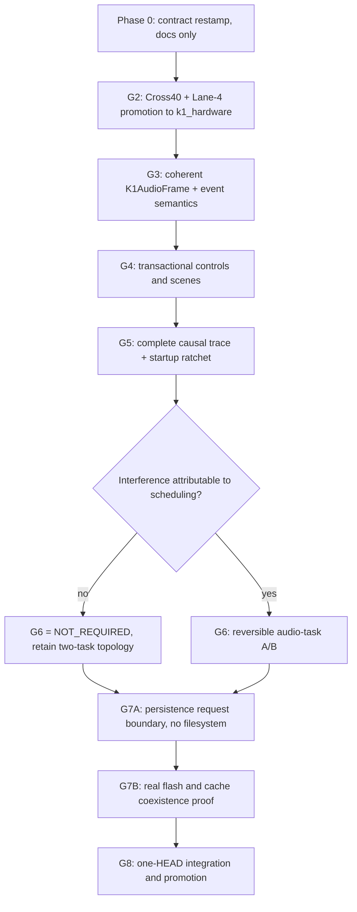

# K1 Scheduling Hardening G2–G8 Implementation Plan

> **For agentic workers:** REQUIRED SUB-SKILL: Use superpowers:subagent-driven-development (recommended) or superpowers:executing-plans to implement this plan task-by-task. Steps use checkbox (`- [ ]`) syntax for tracking.

**Goal:** Close Gate 2 against the Captain-restamped AP service contract (arrival 7500 µs, service p99 ≤ 8000 µs) by promoting the Cross40 × Lane-4 GDFT backend into `k1_hardware`, then execute the unblocked Gate 3–Gate 8 chain: one coherent `K1AudioFrame` publication with reset-aware event sequences, transactional two-channel control/scene commands, a complete capture→photon causal trace with startup fault visibility, a conditional explicit audio-task experiment that is expected to close `NOT_REQUIRED`, a persistence request boundary followed by a separate flash/cache proof, and one integrated promotion HEAD. No device flash occurs anywhere in this plan without a separate, named Captain GO.

**Architecture:** AP owns Core 0, VP owns Core 1, and that topology is locked. Core 0 performs DMA-paced acquisition, one complete DSP transaction, and exactly one coherent publication per hop. Core 1 performs one frame-top acquisition into a VP-local immutable `K1AudioFrame`, renders both channels from that single `const` value, and submits to RMT. Control flows through bounded, typed command channels that separate complete desired state from non-idempotent edges, persistence requests, and forensic history. No broad FreeRTOS rewrite, no multi-actor audio pipeline, no added pacing clock, no speculative priority changes, no DSP or parallel render on Core 1, and no unowned two-slot pointer swap.

**Tech Stack:** C++17 firmware on ESP32-S3 (pioarduino 54.03.20, arduino-esp32 3.2.0, ESP-IDF 5.4.1, FastLED 3.10.3); PlatformIO envs built only through `bash scripts/agent/pio-build.sh <env>`; host regression in pytest with compiled host C++ executables for concurrency oracles; Gate 0 contract loader `scripts/regression-harness/k1_scheduling_gate0.py`; APCAD capture runner `scripts/regression-harness/device_ap_cadence_capture.py`; frame-class comparator `scripts/regression-harness/k1_stage_attribution_abba_compare.py`.

**Spec:** docs/forensics/2026-08-15-freertos-scheduling-audit/EXECUTION_PLAN.md + Captain 2026-08-16 restamp (AP service p99 ≤ 8000 µs; G2 = Cross40+Lane4; G3 unblocked)

## Global Constraints

```text
EXECUTION_MODE = SEQUENTIAL_SINGLE_LANE
AP_ARRIVAL_PERIOD_US = 7500
AP_SERVICE_P99_LIMIT_US = 8000  # NOT 6000; strike 0.8 fraction
TEN_MS_AP_HOP_AUTHORISED = NO
G2_GDFT_CONTRACT = CROSS40_PLUS_LANE4
F887_FLASH = NO until G8 separate GO
B489_FLASH = named gates only with separate GO
ROLLING_ACF / SCHEDULER_THEATRE = OUT
```

Additional binding constraints, all of which survive from `EXECUTION_PLAN.md` and are not relaxed by the restamp:

```text
AP0_VP1_TOPOLOGY                  = LOCK
BROAD_RTOS_REWRITE                = REJECT
MULTI_ACTOR_AUDIO_PIPELINE        = REJECT
ADDED_PACING_CLOCK                = REJECT   (no vTaskDelayUntil, no new tick source)
SPECULATIVE_PRIORITY_OR_PACING    = REJECT
DSP_OR_PARALLEL_RENDER_ON_CORE1   = REJECT
UNOWNED_TWO_SLOT_POINTER_SWAP     = REJECT
VP_LOCAL_FRAME_COPY               = FIRST_IMPLEMENTATION_CANDIDATE  (Candidate A)
TRIPLE_BUFFER_OWNERSHIP           = FALLBACK_IF_COPY_COST_FAILS     (Candidate B)
RADIO_PROMOTION                   = SEPARATE_PROGRAMME (not in G8)
SPECTRAL_24K_180_UPGRADE          = SEPARATE_PROGRAMME (not in G8)
AP_INPUT_INTEGRITY_P4             = SEPARATE_OPEN_LANE (never bundled, never implied closed)
VP_TARGET                         = 120 FPS, 8333 us, effect-code ceiling 2000 us
NOISE_CALIBRATION                 = NEVER auto-fired; `start_noise_cal` requires verbal silence confirmation
BRITISH_ENGLISH                   = REQUIRED in all artefacts produced by this plan
```

Process constraints that bind every task in this plan:

- **One unit, one commit, one gate, one rollback.** Do not bundle two atomic units from `EXECUTION_PLAN.md` §10.2 into one commit.
- **Commit gate.** Docs-only changes commit ungated. Changes under `tests/` or `scripts/` require full `python3 -m pytest -q tests/`. Changes to firmware or `platformio.ini` require full `python3 -m pytest -q tests/` **and** `bash scripts/agent/pio-build.sh k1_hardware`. A focused pytest subset is feedback only and never authorises a commit.
- **Build wrapper only.** Never invoke `pio run` directly, never pass upload, monitor, erase or target tokens. If a new env must be built, extend the `ALLOWED_ENVS` allowlist and the `case` arm in `scripts/agent/pio-build.sh` in the same commit as the env.
- **Two red rule.** A second red on the same failure after one targeted repair halts the unit for decomposition review. Do not loop.
- **Trust-root separation.** An implementation unit may not edit `docs/forensics/2026-08-15-freertos-scheduling-audit/gate0/contract.json`, `gate0/trust_root.json`, thresholds, or frozen fixtures that accept it. The single exception is Phase 0, whose entire purpose is the Captain-authorised contract restamp and which ships no production behaviour.
- **No flash without a named GO.** Every device task in this plan starts with an explicit entry predicate naming the required GO token. Absent the token, the task is not started, not partially started, and not "prepared by flashing once to check".

## Supersession of the G0R plan

- [ ] **Phase 0 Step 0:** Record that [`docs/superpowers/plans/2026-08-16-g0r-cadence-authority.md`](../../superpowers/plans/2026-08-16-g0r-cadence-authority.md) is **SUPERSEDED for live execution** by this document.

```text
G0R_PLAN_STATUS            = SUPERSEDED_FOR_LIVE_EXECUTION
G0R_STAMP_A                = CLOSED  (10 ms AP hop rejected; deployed 7.5 ms hop remains controlling)
TEN_MS_AP_HOP_AUTHORISED   = NO
G0R_R7A                    = CLOSED by stamp A
G0R_R7B / R7C              = NEVER_ENTERED (no hop128 env exists or may be created)
G0R_R8_ABBA                = COMPLETE (evidence retained; superseded as the live lane)
RETAINED_AS_EVIDENCE       = YES  (inventory, amendment draft, loader, comparator T, ABBA pack)
```

The G0R plan is retained as historical authority for the contract loader (`select_contract`), the frame-class comparator pin `T`, the harness firmware pin `H`, and the frozen perturbation limits. Its R0–R6 artefacts remain admissible evidence. What is superseded is its **execution DAG**: no worker may open R7B, create a `hop128` probe env, or treat any part of it as a live instruction. Stamp A closed the 10 ms question in the negative.

## Gate DAG for this plan



Every arrow is a hard dependency. There is no parallel lane. A worker holding this plan executes exactly one phase at a time and closes it with its own commit, its own evidence file, and its own gate result before reading the next phase.

---

## Phase 0 — Contract restamp (documents and oracle only, no production behaviour)

**Purpose:** Make the Captain 2026-08-16 restamp machine-readable so every later gate is judged against 8000 µs rather than the struck 6000 µs, and so `G2_GDFT_CONTRACT = CROSS40_PLUS_LANE4` is a loadable fact rather than prose. This phase ships **no** firmware change.

**Entry:** none beyond a clean tree.

**Files:**
- Create: `docs/forensics/2026-08-15-freertos-scheduling-audit/gate0/amendments/G0R_2026-08-16.stamped.json`
- Modify: [`docs/forensics/2026-08-15-freertos-scheduling-audit/gate0/contract.json`](../../forensics/2026-08-15-freertos-scheduling-audit/gate0/contract.json) — **only** under the Captain restamp authority granted to this phase
- Modify: [`scripts/regression-harness/k1_scheduling_gate0.py`](../../../scripts/regression-harness/k1_scheduling_gate0.py)
- Modify: [`tests/test_scheduling_gate0.py`](../../../tests/test_scheduling_gate0.py)
- Create: `docs/forensics/2026-08-15-freertos-scheduling-audit/evidence/g2-restamp-service-contract.md`
- Modify: [`docs/forensics/2026-08-15-freertos-scheduling-audit/EXECUTION_PLAN.md`](../../forensics/2026-08-15-freertos-scheduling-audit/EXECUTION_PLAN.md) — banner only, negative matrix preserved
- Modify: [`docs/superpowers/plans/2026-08-16-g0r-cadence-authority.md`](../../superpowers/plans/2026-08-16-g0r-cadence-authority.md) — supersession banner
- Modify: [`docs/spec-index.md`](../../spec-index.md), [`docs/handover/HANDOVER_2026-08-15_SCHEDULING_HARDENING_IMPLEMENTATION.md`](../../handover/HANDOVER_2026-08-15_SCHEDULING_HARDENING_IMPLEMENTATION.md), `docs/forensics/2026-08-15-freertos-scheduling-audit/progress.md`, root [`progress.md`](../../../progress.md)

**Interfaces:**
- Consumes: Captain 2026-08-16 restamp; deployed contract `K1_SCHEDULING_GATE0_2026_08_15`
- Produces: contract id `K1_SCHEDULING_GATE0_2026_08_16_R1`; `AP_SERVICE_P99_LIMIT_US = 8000`; `G2_GDFT_CONTRACT = CROSS40_PLUS_LANE4`

- [ ] **Step 1: Capture the pre-restamp trust root.** Record the hash of the file you are about to change so the amendment can prove what it superseded.

```bash
cd /Users/spectrasynq/SpectraSynq_K1_Firmware
git rev-parse HEAD
shasum -a 256 docs/forensics/2026-08-15-freertos-scheduling-audit/gate0/contract.json
shasum -a 256 docs/forensics/2026-08-15-freertos-scheduling-audit/gate0/trust_root.json
shasum -a 256 docs/forensics/2026-08-15-freertos-scheduling-audit/gate0/amendments/G0R_2026-08-16.draft.json
```

- [ ] **Step 2: Write the stamped amendment.** Create `gate0/amendments/G0R_2026-08-16.stamped.json`. It records the restamp as a superseding document and carries the exact old and new values. The draft file stays on disk untouched as the pre-stamp artefact.

```json
{
  "schema_version": 1,
  "amendment_id": "G0R_2026_08_16_STAMPED",
  "status": "CAPTAIN_STAMPED",
  "scope": "DEPLOYED_CONTRACT",
  "promotion_status": "PRODUCTION_CONTRACT_CONTENT",
  "supersedes_contract_id": "K1_SCHEDULING_GATE0_2026_08_15",
  "new_contract_id": "K1_SCHEDULING_GATE0_2026_08_16_R1",
  "old_contract_sha256": "<value from Step 1>",
  "captain_stamp": {
    "date": "2026-08-16",
    "cadence_stamp": "A",
    "ten_ms_ap_hop_authorised": false,
    "ap_arrival_period_us": 7500,
    "ap_service_p99_limit_us": 8000,
    "struck_rule": "ap_service_p99_max_fraction_of_arrival",
    "g2_gdft_contract": "CROSS40_PLUS_LANE4",
    "g3_status": "UNBLOCKED"
  },
  "fields": [
    {
      "path": "margin_rules.ap_service_p99_max_fraction_of_arrival",
      "old": 0.8,
      "new": null,
      "action": "STRIKE",
      "reason": "Captain replaced the derived fraction with an absolute limit"
    },
    {
      "path": "margin_rules.ap_service_p99_max_us",
      "old": null,
      "new": 8000,
      "action": "ADD",
      "reason": "Absolute AP service p99 ceiling restamped 2026-08-16"
    },
    {
      "path": "feature_latency_contracts[ap_publication_freshness].budget_p99_us",
      "old": 6000,
      "new": 8000,
      "action": "REPLACE",
      "reason": "Freshness p99 tracks the restamped service ceiling"
    },
    {
      "path": "production_tuple.ap_arrival_period_us",
      "old": 7500,
      "new": 7500,
      "action": "REAFFIRM",
      "reason": "Stamp A: deployed 12.8 kHz / 96 / d3 hop remains controlling"
    },
    {
      "path": "gdft_service_contract",
      "old": null,
      "new": "CROSS40_PLUS_LANE4",
      "action": "ADD",
      "reason": "Captain selected the Gate 2 spectral contract"
    }
  ],
  "unchanged": [
    "margin_rules.ap_max_consecutive_over_period",
    "margin_rules.ap_recovery_hops_max",
    "margin_rules.ap_max_must_fit_measured_dma_cushion",
    "margin_rules.shared_copy_lock_p99_max_fraction_of_ap_period",
    "margin_rules.shared_copy_lock_max_fraction_of_ap_period",
    "margin_rules.instrumented_vs_minimal_p99_regression_max_fraction",
    "margin_rules.instrumented_capture_drop_max",
    "vp_contract",
    "required_trace_fields",
    "required_faults"
  ]
}
```

- [ ] **Step 3: Write failing loader tests before touching `contract.json`.** Add to `tests/test_scheduling_gate0.py`. These must call the real loader, not re-parse JSON in the test body.

```python
def test_deployed_contract_carries_restamped_absolute_p99(oracle):
    sel = oracle.select_contract(ROOT, pointer_path=None, build_env="k1_hardware")
    assert sel.selected_contract_id == "K1_SCHEDULING_GATE0_2026_08_16_R1"
    assert sel.selected_period_us == 7500
    assert sel.selected_p99_limit_us == 8000
    assert sel.selection_reason == "no_pointer_deployed_contract"
    assert sel.scope == "DEPLOYED"

def test_struck_fraction_rule_is_absent_not_reinterpreted(oracle):
    contract = oracle.load_json(oracle.DEFAULT_CONTRACT)
    assert "ap_service_p99_max_fraction_of_arrival" not in contract["margin_rules"]
    assert contract["margin_rules"]["ap_service_p99_max_us"] == 8000

def test_gdft_service_contract_is_cross40_plus_lane4(oracle):
    contract = oracle.load_json(oracle.DEFAULT_CONTRACT)
    assert contract["gdft_service_contract"]["selected"] == "CROSS40_PLUS_LANE4"
    assert contract["gdft_service_contract"]["x2_crossover_bin"] == 40
    assert contract["gdft_service_contract"]["lane4_exact_backend"] is True

def test_ten_ms_hop_is_still_refused(oracle):
    contract = oracle.load_json(oracle.DEFAULT_CONTRACT)
    assert contract["production_tuple"]["ap_arrival_period_us"] == 7500
    assert contract["production_tuple"]["samples_per_chunk"] == 96
    assert contract["production_tuple"]["tempo_novelty_decimation"] == 3

def test_service_limits_helper_reports_8000_not_6000(oracle):
    limits = oracle.service_limits_from_contract(oracle.load_json(oracle.DEFAULT_CONTRACT))
    assert limits["ap_service_p99_max_us"] == 8000
    assert limits["ap_arrival_period_us"] == 7500
    assert limits["ap_max_consecutive_over_period"] == 1
    assert limits["ap_recovery_hops_max"] == 2
```

- [ ] **Step 4: Confirm the new tests fail for the right reason.**

```bash
python3 -m pytest -q tests/test_scheduling_gate0.py -k "restamp or struck or cross40 or ten_ms or 8000"
```

Expected: failures naming the old id `K1_SCHEDULING_GATE0_2026_08_15`, the absent `ap_service_p99_max_us`, and the absent `gdft_service_contract`. A test that passes before the edit is testing nothing; delete and rewrite it.

- [ ] **Step 5: Edit `gate0/contract.json`.** Apply exactly the amendment's field list. Set `"contract_id": "K1_SCHEDULING_GATE0_2026_08_16_R1"`, add `"superseded_contract_id": "K1_SCHEDULING_GATE0_2026_08_15"`, add `"amendment_path": "docs/forensics/2026-08-15-freertos-scheduling-audit/gate0/amendments/G0R_2026-08-16.stamped.json"`, delete `margin_rules.ap_service_p99_max_fraction_of_arrival`, add `margin_rules.ap_service_p99_max_us: 8000`, change the `ap_publication_freshness` budget to `8000`, and add:

```json
"gdft_service_contract": {
  "selected": "CROSS40_PLUS_LANE4",
  "x2_crossover_bin": 40,
  "lane4_exact_backend": true,
  "spectral_windowing": false,
  "sample_rate_hz": 12800,
  "samples_per_chunk": 96,
  "authority": "captain_restamp_2026_08_16",
  "promotion_gate": "G2"
}
```

Change nothing else. In particular do not touch `vp_contract`, `required_trace_fields`, `required_faults`, or the lock-margin fractions.

- [ ] **Step 6: Update the loader** in `scripts/regression-harness/k1_scheduling_gate0.py` so `service_limits_from_contract` reads the absolute `ap_service_p99_max_us` and **fails closed** if both the absolute key and the struck fraction key are present, or if neither is. There must be exactly one way to obtain the number.

```python
def service_limits_from_contract(contract: dict[str, Any]) -> dict[str, Any]:
    rules = contract["margin_rules"]
    absolute = rules.get("ap_service_p99_max_us")
    fraction = rules.get("ap_service_p99_max_fraction_of_arrival")
    if absolute is not None and fraction is not None:
        raise Gate0Error(
            "ambiguous AP service p99: both ap_service_p99_max_us and the struck "
            "ap_service_p99_max_fraction_of_arrival are present"
        )
    if absolute is None:
        raise Gate0Error("contract does not declare ap_service_p99_max_us")
    ...
```

- [ ] **Step 7: Update the frame-class comparator to consume the contract, not a literal.** In [`scripts/regression-harness/k1_stage_attribution_abba_compare.py`](../../../scripts/regression-harness/k1_stage_attribution_abba_compare.py), `_service_check` must obtain its p99 ceiling from the passed contract object via `service_limits_from_contract`. Confirm no bare `6000` remains as a service ceiling. The perturbation limits stay frozen exactly as pinned in commit `T` (`ap_p99_delta_max_us = 375`, `instrumented_capture_drop_max = 0`, `throughput_delta_max_hz = 2.0`, `repeatability_admission_limit_pp = 2.0`); the restamp changes the **service** ceiling only, never a perturbation limit.

```bash
rg -n "6000" scripts/regression-harness/k1_stage_attribution_abba_compare.py scripts/regression-harness/k1_scheduling_gate0.py
```

- [ ] **Step 8: Re-run the loader and comparator suites to green.**

```bash
python3 -m pytest -q tests/test_scheduling_gate0.py
python3 -m pytest -q tests/test_k1_stage_attribution_abba_compare.py
```

- [ ] **Step 9: Re-score the existing Cross40 × Lane-4 evidence against the restamped ceiling.** This is a re-scoring of a capture already on disk, not a new capture and not a flash.

```bash
python3 -m json.tool docs/forensics/runtime-evidence/20260816T-g2-lane4-cross40/RESULT.json > /dev/null
python3 scripts/regression-harness/k1_stage_attribution_abba_compare.py --help
```

Write `docs/forensics/2026-08-15-freertos-scheduling-audit/evidence/g2-restamp-service-contract.md` containing the following table verbatim from `20260816T-g2-lane4-cross40/RESULT.json`, plus the honest caveats beneath it:

| Leg | Compact soak p99 high (µs) | Max (µs) | Max consecutive over-period | Measured AP rate (Hz) | vs 8000 µs p99 |
|---|---:|---:|---:|---:|---|
| L1 no-play | 7552 | 7920 | 1 | 133.337 | PASS |
| L2 anchor (music) | 7712 | 8027 | 1 | 133.334 | PASS |

Caveats that must be written down, not omitted:

1. The controlling number is the **compact soak p99 high**. Do not substitute mean (5421 µs / 5677 µs) or nominal rate.
2. The music leg's single-frame **max is 8027 µs**, above the 8000 µs p99 ceiling. `ap_service_p99_max_us` governs p99, not max; `ap_max_must_fit_measured_dma_cushion` governs max and is a **separate** open check that Gate 2 must satisfy from the DMA cushion measurement, not by comparison to 8000.
3. Exclusive frame-class p99 for `tempo_only` is 7630 µs (no-play) and 7792 µs (music); both sit under 8000 µs. `onset_only` and `tempo_and_onset` remain `MISSING_MARKER` because APCAD rows carry no onset marker. A missing marker is not a pass.
4. `L1_noplay` reported `sample_age.status = GROWING` (12000 µs → 12822 µs, delta 822 µs over 666 rows) while `L2_anchor` reported `STABLE`. Growing sample age is a live Gate 2 risk and must be re-confirmed on the promotion build.
5. This re-scoring is evidence from the **probe** environment. It supports the Captain's contract selection; it does not by itself close Gate 2 on `k1_hardware`.

- [ ] **Step 10: Stamp the status documents.** Paste this block into `docs/spec-index.md`, the scheduling handover, `docs/forensics/2026-08-15-freertos-scheduling-audit/progress.md`, and root `progress.md` where the stale sentence lives. Correct only status sentences.

```text
G0_ORACLE_IMPLEMENTATION      = CLOSED
G0_CONTRACT_CONTENT           = RESTAMPED 2026-08-16 (K1_SCHEDULING_GATE0_2026_08_16_R1)
AP_ARRIVAL_PERIOD_US          = 7500
AP_SERVICE_P99_LIMIT_US       = 8000
TEN_MS_AP_HOP_AUTHORISED      = NO
G2_GDFT_CONTRACT              = CROSS40_PLUS_LANE4
G2_STATUS                     = IN_IMPLEMENTATION (promotion to k1_hardware)
G3                            = UNBLOCKED
F887_PRODUCTION_FLASH         = NO until G8 separate GO
B489_FLASH                    = named gates only, separate GO each time
G0R_PLAN                      = SUPERSEDED_FOR_LIVE_EXECUTION
```

- [ ] **Step 11: Add the banners.** In `EXECUTION_PLAN.md`, replace the G0R stamp-A banner with a restamp banner that states the 8000 µs ceiling, the Cross40 × Lane-4 selection, and that Gate 3 is unblocked. Do **not** erase the negative matrix in §2. In `docs/superpowers/plans/2026-08-16-g0r-cadence-authority.md`, add the supersession banner from the Supersession section above at the very top of the file.

- [ ] **Step 12: Full gate and commit.** Phase 0 touches `scripts/` and `tests/`, so the pytest tier applies.

```bash
python3 -m pytest -q tests/
git add docs/forensics/2026-08-15-freertos-scheduling-audit/gate0/ \
        docs/forensics/2026-08-15-freertos-scheduling-audit/evidence/g2-restamp-service-contract.md \
        docs/forensics/2026-08-15-freertos-scheduling-audit/EXECUTION_PLAN.md \
        docs/superpowers/plans/ docs/spec-index.md docs/handover/ progress.md \
        docs/forensics/2026-08-15-freertos-scheduling-audit/progress.md \
        scripts/regression-harness/k1_scheduling_gate0.py \
        scripts/regression-harness/k1_stage_attribution_abba_compare.py \
        tests/test_scheduling_gate0.py tests/test_k1_stage_attribution_abba_compare.py
git commit -m "$(cat <<'EOF'
docs: restamp Gate 0 AP service contract to 8000 us p99

Captain 2026-08-16 restamp. Strikes the derived 0.8 arrival fraction and
sets an absolute ap_service_p99_max_us of 8000. Reaffirms the deployed
12.8 kHz / 96 / d3 / 7500 us hop; 10 ms remains unauthorised. Records
CROSS40_PLUS_LANE4 as the selected Gate 2 GDFT service contract and
unblocks Gate 3. No firmware change. Supersedes the G0R plan for live
execution.
EOF
)"
```

**Gate 0 exit criteria:** loader returns 8000 µs for `k1_hardware` with no pointer; the struck fraction key is absent; `gdft_service_contract` is loadable; full pytest green; no firmware file modified in this commit.

---

## G2 — Promote Cross40 + Lane-4 exact backend to `k1_hardware`

**Dependencies:** Phase 0 closed.

**Behaviour posture:** intended spectral change. This unit may share a commit with nothing else — no publication work, no scheduler work, no radio work.

**Purpose:** Make `K1_GDFT_X2_CROSSOVER_BIN=40u` and the four-lane exact Goertzel backend the production configuration, with the probe macro `K1_GDFT_LANE4_PROBE` retained as an alias so every existing non-shippable probe env and its host tests keep working unchanged.

**Files:**
- Modify: [`SPECTRASYNQ_K1_FIRMWARE/audio/k1_gdft_core.cpp`](../../../SPECTRASYNQ_K1_FIRMWARE/audio/k1_gdft_core.cpp)
- Modify: [`SPECTRASYNQ_K1_FIRMWARE/audio/k1_gdft_lane4_exact.h`](../../../SPECTRASYNQ_K1_FIRMWARE/audio/k1_gdft_lane4_exact.h) — comment header only, to name the production selector
- Modify: [`platformio.ini`](../../../platformio.ini) — `[env:k1_hardware]` `build_flags` only
- Modify: [`tests/test_gdft_lane4_exact_probe.py`](../../../tests/test_gdft_lane4_exact_probe.py)
- Modify: [`tests/test_gdft_lane4_cross40_combined.py`](../../../tests/test_gdft_lane4_cross40_combined.py)
- Create: `tests/test_gdft_cross40_lane4_production_promotion.py`
- Create: `docs/forensics/2026-08-15-freertos-scheduling-audit/evidence/g2-cross40-lane4-promotion.md`

**Interfaces:**
- Consumes: `gdft_service_contract` from the restamped `gate0/contract.json`
- Produces: production spectral geometry `block_size[0] = 978`, `block_size[39] = 102`, `block_size[40] = 194`, bins ≥ 40 unchanged from Cross0

### G2.1 — Introduce the production selector without breaking the probes

- [ ] **Step 1: Write the failing promotion test first.** Create `tests/test_gdft_cross40_lane4_production_promotion.py`:

```python
"""Production promotion gate for the Cross40 x Lane-4 GDFT service contract."""

from __future__ import annotations

import json
from pathlib import Path

ROOT = Path(__file__).resolve().parents[1]
PIO = ROOT / "platformio.ini"
CORE = ROOT / "SPECTRASYNQ_K1_FIRMWARE" / "audio" / "k1_gdft_core.cpp"
CONTRACT = (
    ROOT / "docs" / "forensics" / "2026-08-15-freertos-scheduling-audit"
    / "gate0" / "contract.json"
)


def _section(text: str, name: str) -> str:
    start = text.index(f"[env:{name}]")
    end = text.find("\n[env:", start + 1)
    return text[start : end if end >= 0 else len(text)]


def test_k1_hardware_declares_cross40_and_lane4_v1():
    section = _section(PIO.read_text(encoding="utf-8"), "k1_hardware")
    assert "-DK1_GDFT_X2_CROSSOVER_BIN=40u" in section
    assert "-DK1_GDFT_LANE4_V1=1" in section
    assert "-DK1_GDFT_LANE4_PROBE" not in section
    assert "-DK1_SPECTRAL_WINDOW_V1" not in section


def test_production_flags_match_the_stamped_service_contract():
    contract = json.loads(CONTRACT.read_text(encoding="utf-8"))
    gdft = contract["gdft_service_contract"]
    section = _section(PIO.read_text(encoding="utf-8"), "k1_hardware")
    assert f"-DK1_GDFT_X2_CROSSOVER_BIN={gdft['x2_crossover_bin']}u" in section
    assert gdft["lane4_exact_backend"] is True
    assert "-DK1_GDFT_LANE4_V1=1" in section
    assert gdft["spectral_windowing"] is False


def test_probe_macro_remains_a_compatibility_alias():
    core = CORE.read_text(encoding="utf-8")
    assert "#if K1_GDFT_LANE4_PROBE && !K1_GDFT_LANE4_V1" in core
    assert "#define K1_GDFT_LANE4_V1 1" in core
    assert "#if K1_GDFT_LANE4_V1" in core
    assert "#endif  // K1_GDFT_LANE4_V1" in core


def test_int64_prerequisites_are_present_in_production():
    section = _section(PIO.read_text(encoding="utf-8"), "k1_hardware")
    assert "-DK1_GDFT_INT64_MAGNITUDE_V1" in section
    assert "-DK1_GDFT_INT64_RECURRENCE_V1" in section
```

```bash
python3 -m pytest -q tests/test_gdft_cross40_lane4_production_promotion.py
```

Expected: four failures.

- [ ] **Step 2: Add the alias block to `k1_gdft_core.cpp`.** Replace the current `K1_GDFT_LANE4_PROBE` default block (lines around 33–58) with a two-macro form where `K1_GDFT_LANE4_V1` is the single selector and the probe macro is a backward-compatible alias:

```c
// Production selector for the exact four-lane Goertzel backend.
#ifndef K1_GDFT_LANE4_V1
#define K1_GDFT_LANE4_V1 0
#endif
// Compatibility alias: the non-shippable probe envs and their host tests still
// pass -DK1_GDFT_LANE4_PROBE=1. It selects the identical backend.
#ifndef K1_GDFT_LANE4_PROBE
#define K1_GDFT_LANE4_PROBE 0
#endif
#if K1_GDFT_LANE4_PROBE && !K1_GDFT_LANE4_V1
#undef K1_GDFT_LANE4_V1
#define K1_GDFT_LANE4_V1 1
#endif
```

Then change every `#if K1_GDFT_LANE4_PROBE` gate in this translation unit to `#if K1_GDFT_LANE4_V1`, and every closing comment `#endif  // K1_GDFT_LANE4_PROBE` to `#endif  // K1_GDFT_LANE4_V1`. Retain both `#error` guards verbatim, retargeted to the new selector: the backend still requires `K1_GDFT_INT64_RECURRENCE_V1` and `K1_GDFT_INT64_MAGNITUDE_V1`, and it is still incompatible with `K1_SPECTRAL_WINDOW_V1`.

- [ ] **Step 3: Reconcile the two probe tests that assert the old spelling.** `tests/test_gdft_lane4_exact_probe.py` asserts `"#if K1_GDFT_LANE4_PROBE" in core` and `"#endif  // K1_GDFT_LANE4_PROBE" in core`. Those assertions describe an implementation detail of the probe gate, not a Gate 0 threshold or a frozen fixture, so this unit may edit them. Replace them with assertions that prove **both** halves of the alias contract:

```python
def test_lane4_gate_is_the_production_selector_with_probe_alias():
    core = CORE.read_text(encoding="utf-8")
    assert "#if K1_GDFT_LANE4_V1" in core
    assert "#endif  // K1_GDFT_LANE4_V1" in core
    assert "#if K1_GDFT_LANE4_PROBE && !K1_GDFT_LANE4_V1" in core
    assert "#if K1_GDFT_LANE4_PROBE\n" not in core  # no orphan probe-only gate
```

Leave `test_gdft_lane4_exact_probe.py::_capture` and the `PRODUCTION_INT64_DEFINES` list alone; the host oracle still drives the backend through `K1_GDFT_LANE4_PROBE=1` and must continue to produce bit-identical output through the alias. In `tests/test_gdft_lane4_cross40_combined.py`, the env-shape assertion at `test_combined_probe_env_is_full_attribution_cross40_lane4_only` is unchanged: the probe env still adds exactly `-DK1_GDFT_X2_CROSSOVER_BIN=40u` and `-DK1_GDFT_LANE4_PROBE=1`.

- [ ] **Step 4: Prove the alias is semantically inert before promoting anything.** The existing bit-identity tests are the oracle. They must pass with the alias in place and with no env change yet.

```bash
python3 -m pytest -q tests/test_gdft_lane4_exact_probe.py tests/test_gdft_lane4_cross40_combined.py
```

If `test_exact_driver_cross40_scalar_versus_lane4_is_bit_identical` or `test_captain_fixture_set_cross40_scalar_versus_lane4_is_bit_identical` goes red, the alias refactor changed behaviour. Revert the alias block and re-approach; do not proceed.

- [ ] **Step 5: Commit the alias as its own inert step** (firmware tier: full pytest plus production build).

```bash
python3 -m pytest -q tests/
bash scripts/agent/pio-build.sh k1_hardware
git add SPECTRASYNQ_K1_FIRMWARE/audio/k1_gdft_core.cpp \
        SPECTRASYNQ_K1_FIRMWARE/audio/k1_gdft_lane4_exact.h \
        tests/test_gdft_lane4_exact_probe.py
git commit -m "refactor: name the lane-4 exact backend K1_GDFT_LANE4_V1

Introduces the production selector and keeps K1_GDFT_LANE4_PROBE as a
compatibility alias for the non-shippable probe envs. No env enables the
new selector yet, so k1_hardware behaviour is unchanged."
```

### G2.2 — Enable Cross40 and Lane-4 on `k1_hardware`

- [ ] **Step 6: Record the pre-promotion binary identity.** This is the rollback anchor and the byte-delta baseline.

```bash
bash scripts/agent/pio-build.sh k1_hardware
shasum -a 256 .pio/build/k1_hardware/firmware.bin .pio/build/k1_hardware/firmware.elf
ls -l .pio/build/k1_hardware/firmware.bin
git rev-parse HEAD
```

- [ ] **Step 7: Add exactly two flags to `[env:k1_hardware]` `build_flags`** in `platformio.ini`, immediately after the `-DK1_GDFT_INT64_RECURRENCE_V1` line, with a comment block that names the authority and the revert:

```ini
    ; G2 GDFT service contract (Captain restamp 2026-08-16). Cross40 halves the
    ; low-bin analysis window below bin 40 (block_size[0] 1956 -> 978) and the
    ; exact four-lane backend computes four bins per pass. Host proof: lane-4 is
    ; bit-identical to the scalar recurrence under Cross40
    ; (tests/test_gdft_lane4_cross40_combined.py). Device evidence:
    ; docs/forensics/runtime-evidence/20260816T-g2-lane4-cross40/RESULT.json.
    ; Contract: gate0/contract.json gdft_service_contract.
    ; REVERT = delete these two lines (restores Cross0 scalar, byte-identical).
    -DK1_GDFT_X2_CROSSOVER_BIN=40u
    -DK1_GDFT_LANE4_V1=1
```

- [ ] **Step 8: Run the promotion tests and the full spectral suite.**

```bash
python3 -m pytest -q tests/test_gdft_cross40_lane4_production_promotion.py
python3 -m pytest -q tests/test_gdft_center_honesty.py tests/test_spectral_honesty.py \
    tests/test_nyquist_bin_hygiene_static.py tests/test_gdft_int64_magnitude.py \
    tests/test_gdft_int64_recurrence.py tests/test_scheduling_gdft_service_matrix.py
```

`tests/test_nyquist_bin_hygiene_static.py` asserts `#define K1_GDFT_X2_CROSSOVER_BIN 0u` in `SPECTRASYNQ_K1_FIRMWARE/system/constants.h`. That default is the compile-time fallback and stays `0u`; the production value now arrives from the env flag. If the test instead asserts an effective production value of zero, update the assertion to read the value from the `k1_hardware` env and record the change in the evidence file. `tests/test_scheduling_gdft_service_matrix.py` asserts the **bench baseline probe** carries no crossover define; that env extends `k1_bench_im69d`, not `k1_hardware`, so it must stay green untouched. If it goes red, the flag was added in the wrong env.

- [ ] **Step 9: Handle the golden-master shift explicitly.** Cross40 changes low-bin spectral geometry, so any golden that captures production spectra will move. This is an **authorised** behaviour change: the authority is the Captain restamp recorded in `gate0/contract.json` `gdft_service_contract`.

```bash
python3 -m pytest -q tests/test_golden_master.py tests/test_k1_av_regression_static.py
```

If a golden fails, do **not** silently regenerate it inside this commit. Produce, as a separate commit immediately after the promotion commit, a golden refresh that carries: the old and new golden hashes, the count of changed bins, confirmation that bins ≥ 40 are unchanged, and a pointer to `gdft_service_contract` as the authorising ticket. A golden refresh made to accommodate an unexplained failure is forbidden.

- [ ] **Step 10: Full firmware gate and byte-delta manifest.**

```bash
python3 -m pytest -q tests/
bash scripts/agent/pio-build.sh k1_hardware
shasum -a 256 .pio/build/k1_hardware/firmware.bin .pio/build/k1_hardware/firmware.elf
ls -l .pio/build/k1_hardware/firmware.bin
```

Write `docs/forensics/2026-08-15-freertos-scheduling-audit/evidence/g2-cross40-lane4-promotion.md` with: pre and post `firmware.bin` SHA-256 and size, the two added flags, the alias contract, the host bit-identity results, the re-scored device evidence table from Phase 0 Step 9, the four caveats reproduced verbatim, and an explicit statement that this promotion is a **compile-time configuration change proven on host and on the probe environment**, with device eyes-on and a `k1_hardware` capture still outstanding.

- [ ] **Step 11: Commit the promotion.**

```bash
git add platformio.ini tests/test_gdft_cross40_lane4_production_promotion.py \
        tests/test_gdft_lane4_cross40_combined.py tests/test_nyquist_bin_hygiene_static.py \
        docs/forensics/2026-08-15-freertos-scheduling-audit/evidence/g2-cross40-lane4-promotion.md
git commit -m "feat: promote Cross40 x Lane-4 GDFT service contract to k1_hardware

Captain restamp 2026-08-16 selected CROSS40_PLUS_LANE4 as the Gate 2
spectral contract. Adds K1_GDFT_X2_CROSSOVER_BIN=40u and
K1_GDFT_LANE4_V1=1 to env:k1_hardware only. Lane-4 is bit-identical to
the scalar recurrence under Cross40 on host. Probe envs are unchanged
through the K1_GDFT_LANE4_PROBE alias. Does not close device eyes-on."
```

### G2.3 — Device confirmation on the bench (gated)

**Entry predicate:** `B489_G2_CONFIRM_FLASH = GO` issued separately by Captain, plus a Captain-confirmed audible fixture for the music series. Without both tokens this sub-phase does not start.

- [ ] **Step 12:** Verify device identity against [`docs/hardware/device-build-registry.md`](../../hardware/device-build-registry.md) before anything else. B489A500 takes `k1_bench_*` envs only. F887A500 is `NO` in this phase. Stop on any mismatch.

- [ ] **Step 13:** Capture a paired min/full APCAD series on the promoted spectral configuration using the pinned runner and the pinned comparator `T`, following the same boot protocol, reset method, warm-up period, persisted-configuration fingerprint, calibration state and fixture state as the `20260816T-g2-lane4-cross40` pack. Two independent A-B-B-A series: one no-playback, one music. Never one mixed sequence.

- [ ] **Step 14:** Score with the comparator against the **restamped** contract and record, per leg: compact soak p99 high, max, max consecutive over-period, recovery hops, measured AP rate, `sample_age.status`, drops, generation discontinuities, and the exclusive frame-class partition.

- [ ] **Step 15: Gate 2 close predicate.** All of the following, or Gate 2 stays open:

```text
compact_soak_p99_high_us  <= 8000            for every leg
max_consecutive_over_period <= 1             for every leg
recovery_hops             <= 2               for every leg
measured_ap_rate_hz       in [132.0, 134.5]  for every leg
sample_age.status         != GROWING         for every leg
drops                     == 0
generation_discontinuities == 0
ap_max_us fits the measured DMA cushion      (separate check, not "max <= 8000")
Captain perceptual A/B on real music         = PASS
```

The music-leg max of 8027 µs observed on the probe must be re-examined here against the measured cushion. If the cushion cannot absorb it, Gate 2 does not close, and the response is to reopen the spectral contract — never to enlarge the hop and never to raise priority.

**G2 exit criteria:** promotion commit landed, full pytest green, `k1_hardware` builds, device close predicate satisfied under a separate GO, evidence file complete.

---

## G3 — Coherent `K1AudioFrame` publication and event semantics (Candidate A)

**Dependencies:** G2 closed. Gate 3 is unblocked by the Captain restamp.

**Behaviour posture:** correctness change. May share a commit with its own tests only.

**Purpose:** Replace scattered Core-1 reads of live AP globals with one shared-copy publication and one VP-local immutable frame, and give discrete musical events reset-aware cumulative identity so a beat or onset can never be lost or double-counted across a slow render.

**Files:**
- Create: [`SPECTRASYNQ_K1_FIRMWARE/audio/k1_audio_frame.h`](../../../SPECTRASYNQ_K1_FIRMWARE/audio/k1_audio_frame.h)
- Create: [`SPECTRASYNQ_K1_FIRMWARE/audio/k1_audio_frame.cpp`](../../../SPECTRASYNQ_K1_FIRMWARE/audio/k1_audio_frame.cpp)
- Create: [`tests/test_k1_audio_frame_interleave.py`](../../../tests/test_k1_audio_frame_interleave.py)
- Create: [`scripts/regression-harness/k1_audio_frame_replay.py`](../../../scripts/regression-harness/k1_audio_frame_replay.py)
- Create: `tests/test_k1_audio_frame_ownership_static.py`
- Modify: [`SPECTRASYNQ_K1_FIRMWARE/SPECTRASYNQ_K1_FIRMWARE.ino`](../../../SPECTRASYNQ_K1_FIRMWARE/SPECTRASYNQ_K1_FIRMWARE.ino) — publish at the end of the AP transaction, acquire once at VP frame-top
- Modify: `SPECTRASYNQ_K1_FIRMWARE/director/k1_*.cpp` and `SPECTRASYNQ_K1_FIRMWARE/effects/light_mode_*.cpp` — consume the `const` frame instead of live globals
- Modify: [`platformio.ini`](../../../platformio.ini) — `[env:k1_hardware]` gains `-DK1_AUDIO_FRAME_V1=1`
- Create: `docs/forensics/2026-08-15-freertos-scheduling-audit/evidence/g3-coherent-frame-implementation.md`

`build_src_filter` for `k1_hardware` already includes `+<audio/k1_*.cpp>`, so `k1_audio_frame.cpp` enters the build with no filter change.

**Interfaces:**
- Consumes: the completed AP transaction on Core 0; `k1_tempo_read()`, `k1_onset_beat_read()`, `k1_audio_snapshot_read()` as producers
- Produces: `k1_audio_frame_publish()` on Core 0 and `k1_audio_frame_acquire()` on Core 1; counters `mixed_generation_count`, `generation_skip_count`, `acquire_lock_wait_us`, `publish_lock_hold_us`

### G3.1 — Define the frame

- [ ] **Step 1: Write `k1_audio_frame.h`.** Fixed-size, trivially copyable POD, internal RAM, no Arduino types in the struct, no pointers, no heap.

```cpp
#pragma once

#include <stdint.h>

#include "k1_semantic_state.h"

// One complete AP generation, published once per hop after every semantic stage
// has finished. Trivially copyable so both the shared publication and the
// VP-local acquisition are plain value copies inside a short critical section.
struct K1AudioFrame {
  // --- identity and timing (gate0/contract.json required_trace_fields) -------
  uint32_t boot_epoch;
  uint32_t ap_generation;
  uint32_t capture_sequence;
  uint32_t i2s_read_return_us;
  uint32_t newest_sample_estimate_us;
  uint32_t oldest_sample_estimate_us;
  uint16_t sample_time_assumption_id;   // 1 == I2S_DMA_RETURN_ESTIMATE_V1
  uint32_t ap_publish_us;

  // --- reset-aware discrete event identity ----------------------------------
  uint32_t onset_epoch;
  uint32_t onset_sequence_total;
  uint32_t last_onset_time_us;
  float    last_onset_strength;
  uint32_t beat_epoch;
  uint32_t beat_sequence_total;
  uint32_t last_beat_time_us;

  // --- continuous semantic state -------------------------------------------
  AudioSemanticState semantic;

  // --- saturation and coherence counters ------------------------------------
  uint32_t publish_overwrite_count;   // publications never consumed by VP
  uint32_t dropped_event_records;     // reserved; zero until an event ring exists
};

static_assert(sizeof(K1AudioFrame) <= 512,
              "K1AudioFrame must stay small enough to copy inside the AP hop");

// Core 0 only. Copies a completed frame into the shared publication slot.
void k1_audio_frame_publish(const K1AudioFrame& producer_next);

// Core 1 only, once per VP frame top. Copies the newest complete publication
// into the caller's VP-local frame. Returns false if no publication exists yet.
bool k1_audio_frame_acquire(K1AudioFrame* out);

struct K1AudioFrameStats {
  uint32_t mixed_generation_count;
  uint32_t generation_skip_count;
  uint32_t publish_count;
  uint32_t acquire_count;
  uint32_t publish_lock_hold_us_max;
  uint32_t acquire_lock_wait_us_max;
};

void k1_audio_frame_stats(K1AudioFrameStats* out);
```

- [ ] **Step 2: Write `k1_audio_frame.cpp`.** One `portMUX_TYPE` spinlock. The critical section contains a value copy, a generation store and counter arithmetic — nothing else. No DSP, no smoothing, no logging, no allocation, no derived work, no I/O.

```cpp
#include "k1_audio_frame.h"

#if defined(ARDUINO) && !defined(K1_AUDIO_FRAME_HOST_TEST)
#include <Arduino.h>
static portMUX_TYPE k1_audio_frame_mux = portMUX_INITIALIZER_UNLOCKED;
#define K1_AF_ENTER() portENTER_CRITICAL(&k1_audio_frame_mux)
#define K1_AF_EXIT()  portEXIT_CRITICAL(&k1_audio_frame_mux)
#else
#include "k1_audio_frame_host_shim.h"   // deterministic scheduler for host tests
#endif

static K1AudioFrame  s_published;
static bool          s_has_publication = false;
static K1AudioFrameStats s_stats;
```

`k1_audio_frame_publish` builds nothing: the caller has already assembled `producer_next` outside the lock. Publication order inside the lock is payload first, generation last. `k1_audio_frame_acquire` copies value and generation together and records the acquisition instant.

- [ ] **Step 3: Write the host shim** `SPECTRASYNQ_K1_FIRMWARE/audio/k1_audio_frame_host_shim.h`, compiled only under `K1_AUDIO_FRAME_HOST_TEST`. It provides `K1_AF_ENTER` / `K1_AF_EXIT` backed by a deterministic cooperative scheduler with an injectable yield point after every copy segment, so the interleave cases below are reproducible rather than probabilistic. The shim must never enter a production build; `tests/test_dev_instrumentation_boundary.py` is the ratchet that proves it.

### G3.2 — The eight required interleave cases

All eight live in [`tests/test_k1_audio_frame_interleave.py`](../../../tests/test_k1_audio_frame_interleave.py). Each compiles `k1_audio_frame.cpp` with `-DK1_AUDIO_FRAME_HOST_TEST=1` into a host executable and drives it through the deterministic scheduler, following the compile-and-run pattern already used by `tests/test_gdft_lane4_exact_probe.py::_capture`. Text-presence assertions are not acceptable for any of these eight: a small host executable can exercise the real primitive, so it must.

Write all eight as failing tests before implementing the publication path.

```bash
python3 -m pytest -q tests/test_k1_audio_frame_interleave.py
```

- [ ] **Case 1 — Consumer during a private producer build sees the previous complete frame.**
  *Setup:* publish generation `N` and let the consumer acquire it. *Stimulus:* the producer begins assembling `producer_next` for generation `N+1`, mutating every field of its private struct, and the scheduler yields to the consumer after each field write. *Oracle:* every consumer acquisition during the private build returns generation `N` with the complete generation-`N` payload; no field of `N+1` is ever visible. *Assertion:* `acquired.ap_generation == N` and a field-by-field comparison against the frozen generation-`N` value for all yield points. *Must fail if:* the producer assembles into the shared slot instead of a private struct.

- [ ] **Case 2 — Producer and consumer paused after each copy segment see only complete old or new values.**
  *Setup:* the shared copy is instrumented into K segments (word-wise or field-wise). *Stimulus:* for every segment index `i` in `[0, K)`, run a trial in which the producer is paused immediately after segment `i` and the consumer performs a full acquisition. *Oracle:* every acquisition equals either the complete previous frame or the complete new frame; never a mixture. *Assertion:* for each of the K trials, `acquired == frame_old or acquired == frame_new`, compared over the entire struct, plus `stats.mixed_generation_count == 0`. *Must fail if:* the lock is dropped mid-copy or the copy is performed outside the critical section.

- [ ] **Case 3 — VP-local frame is unchanged through a simulated 40 ms render stall while AP advances.**
  *Setup:* the consumer acquires generation `N` into its VP-local frame. *Stimulus:* simulate a 40 ms render stall — at the 7500 µs arrival period that is five to six AP hops — during which the producer publishes generations `N+1` through `N+6`. The consumer reads its VP-local frame at ten points during the stall. *Oracle:* the VP-local frame is byte-identical at all ten points and still reports generation `N`. *Assertion:* `memcmp(vp_frame_before, vp_frame_after, sizeof(K1AudioFrame)) == 0` at every sample point and `vp_frame.ap_generation == N`. *Must fail if:* VP retains a pointer or reference into shared state rather than a value copy. This is the case that rejects the two-slot-plus-atomic-index candidate.

- [ ] **Case 4 — A generation can never become visible before its payload.**
  *Setup:* the producer publishes a frame whose payload differs from the previous in every field. *Stimulus:* the scheduler yields to the consumer at every instruction boundary inside the publication, including between the payload copy and the generation store. *Oracle:* the consumer never observes generation `N+1` paired with any generation-`N` field, and never observes generation `N` paired with any generation-`N+1` field. *Assertion:* for every observation, `derive_generation_from_payload(acquired) == acquired.ap_generation`, where the payload carries a deliberate per-generation watermark. *Must fail if:* the generation store is hoisted above the payload copy or the compiler reorders across a missing barrier.

- [ ] **Case 5 — Two events between VP frames yield a sequence delta of exactly two.**
  *Setup:* the consumer records `last_consumed_onset_sequence` and `last_consumed_beat_sequence` after acquiring generation `N`. *Stimulus:* the producer publishes generations `N+1` and `N+2`, each carrying exactly one new onset and one new beat, before the consumer acquires again. *Oracle:* the unsigned delta between the newly acquired totals and the retained totals is exactly two for both onset and beat. *Assertion:* `(uint32_t)(acquired.onset_sequence_total - last_consumed_onset_sequence) == 2` and the same for beats. *Must fail if:* events are represented as a per-frame boolean, which loses the first of the two.

- [ ] **Case 6 — Epoch reset and counter wrap create no phantom burst.**
  *Setup:* drive `onset_sequence_total` and `beat_sequence_total` to `0xFFFFFFFE` and let the consumer acquire. *Stimulus part A:* publish three further events so the counters wrap through zero. *Stimulus part B:* in a separate trial, increment `onset_epoch` and `beat_epoch` while resetting the totals to zero, which models an AP restart. *Oracle:* in part A the unsigned delta is exactly three; in part B the consumer detects the epoch change and treats it as a resynchronisation with **zero** implied events rather than a delta of roughly four billion. *Assertion:* part A `(uint32_t)(new_total - old_total) == 3`; part B `acquired.onset_epoch != retained_epoch` and the coalescer reports `new_events == 0`. *Must fail if:* the consumer compares totals without first comparing epochs.

- [ ] **Case 7 — Every field stamp matches the enclosing generation.**
  *Setup:* each producer generation stamps a watermark into every timestamp field, every event field and the embedded `AudioSemanticState`, all derived from the generation number. *Stimulus:* run 10 000 randomised publish/acquire interleavings through the deterministic scheduler with a fixed seed recorded in the test. *Oracle:* for every acquisition, every watermark resolves to the same generation. *Assertion:* `all_watermarks_equal(acquired) == acquired.ap_generation` for all 10 000 acquisitions, and `stats.mixed_generation_count == 0`. *Must fail if:* any field is read from a live global at acquire time rather than copied at publish time.

- [ ] **Case 8 — The fault battery catches every deliberately unsafe variant.**
  This case runs four mutant builds and requires each to be **rejected** by cases 1–7. A mutant that passes is an oracle defect and blocks the whole gate.

| Mutant | Injected defect | Must be caught by |
|---|---|---|
| `MUTANT_EARLY_GENERATION` | store `ap_generation` before the payload copy | Case 4 |
| `MUTANT_DIRECT_GLOBAL` | acquire reads `spectrogram[]` and tempo globals live instead of the copy | Case 7 |
| `MUTANT_TWO_SLOT_REUSE` | replace the VP-local copy with a shared pointer plus atomic index | Case 3 |
| `MUTANT_LOST_EVENT` | represent onset as a per-frame boolean instead of a cumulative sequence | Case 5 |

*Assertion:* the test asserts a non-zero failure for each mutant and names which case caught it, so a future refactor that removes a case is visible as an uncaught mutant.

```python
MUTANTS = {
    "MUTANT_EARLY_GENERATION": "case4_generation_before_payload",
    "MUTANT_DIRECT_GLOBAL": "case7_field_stamp_matches_generation",
    "MUTANT_TWO_SLOT_REUSE": "case3_vp_local_survives_40ms_stall",
    "MUTANT_LOST_EVENT": "case5_two_events_yield_delta_two",
}

def test_fault_battery_rejects_every_unsafe_variant():
    for mutant, expected_case in MUTANTS.items():
        result = run_host_interleave_suite(extra_defines=[f"-D{mutant}=1"])
        assert result.returncode != 0, f"{mutant} was not caught"
        assert expected_case in result.stdout, (
            f"{mutant} was caught, but not by {expected_case}"
        )
```

### G3.3 — Replay harness

- [ ] **Step 4: Write [`scripts/regression-harness/k1_audio_frame_replay.py`](../../../scripts/regression-harness/k1_audio_frame_replay.py).** It replays a recorded sequence of AP generations against a recorded sequence of VP acquisition instants and reports, deterministically and offline:

```text
generations_published
generations_acquired
generation_skip_count            # publications never consumed; expected and counted, not an error
mixed_generation_count           # must be zero
onset_delta_histogram            # distribution of per-VP-frame onset deltas
beat_delta_histogram
epoch_resynchronisations         # count of epoch changes handled as zero-event resync
phantom_burst_count              # must be zero
max_vp_generation_age_us         # against the 8333 us vp_generation_age budget
```

CLI:

```bash
python3 scripts/regression-harness/k1_audio_frame_replay.py \
    --capture docs/forensics/runtime-evidence/<pack>/frames.jsonl \
    --contract docs/forensics/2026-08-15-freertos-scheduling-audit/gate0/contract.json \
    --output docs/forensics/runtime-evidence/<pack>/FRAME_REPLAY.json
```

The replay must load its budgets through `k1_scheduling_gate0.select_contract`, never from a literal, so the restamped 8000 µs and the unchanged 8333 µs VP budget both arrive from the contract.

### G3.4 — Wire the firmware and remove the direct reads

- [ ] **Step 5: Publish from Core 0.** In the `.ino` AP loop, assemble `producer_next` after the final semantic stage completes and call `k1_audio_frame_publish(producer_next)` exactly once per hop. Publication is the last act of the AP transaction. Compile the whole path under `-DK1_AUDIO_FRAME_V1=1` so the off-flag build stays byte-identical and the revert is one line.

- [ ] **Step 6: Acquire once at VP frame top.** In the LED task, call `k1_audio_frame_acquire(&vp_frame)` exactly once per frame, before any effect runs, and record `vp_acquire_us`. Pass `const K1AudioFrame&` down through the director and every effect. No effect, director or channel pass may call `audio_semantic_read()`, `k1_tempo_read()`, `k1_onset_beat_read()`, `k1_audio_snapshot_read()`, or touch `spectrogram[]` / `magnitudes*[]` directly.

- [ ] **Step 7: Write the ownership ratchet** `tests/test_k1_audio_frame_ownership_static.py`, which greps the Core-1 source set and fails on any surviving direct read:

```python
BANNED_IN_CORE1 = (
    "audio_semantic_read(",
    "k1_tempo_read(",
    "k1_onset_beat_read(",
    "k1_audio_snapshot_read(",
    "spectrogram[",
    "magnitudes_final[",
    "magnitudes_normalized[",
)

def test_core1_sources_never_read_live_ap_state():
    offenders = []
    for path in core1_sources():          # effects/, director/, visual/
        text = path.read_text(encoding="utf-8")
        for banned in BANNED_IN_CORE1:
            if banned in text:
                offenders.append(f"{path.relative_to(ROOT)}: {banned}")
    assert offenders == [], "\n".join(offenders)

def test_every_effect_entry_point_takes_a_const_frame():
    ...
```

Expect this test to be red at first with a long offender list. Work the list down file by file; each file's conversion is a mechanical change that must not alter rendered output for a fixed input frame.

- [ ] **Step 8: Run the full suite plus the production build.**

```bash
python3 -m pytest -q tests/test_k1_audio_frame_interleave.py
python3 -m pytest -q tests/test_k1_audio_frame_ownership_static.py
python3 -m pytest -q tests/test_dev_instrumentation_boundary.py
python3 -m pytest -q tests/
bash scripts/agent/pio-build.sh k1_hardware
```

- [ ] **Step 9: Commit the coherent-frame unit.**

```bash
git add SPECTRASYNQ_K1_FIRMWARE/audio/k1_audio_frame.h \
        SPECTRASYNQ_K1_FIRMWARE/audio/k1_audio_frame.cpp \
        SPECTRASYNQ_K1_FIRMWARE/audio/k1_audio_frame_host_shim.h \
        SPECTRASYNQ_K1_FIRMWARE/SPECTRASYNQ_K1_FIRMWARE.ino \
        SPECTRASYNQ_K1_FIRMWARE/director/ SPECTRASYNQ_K1_FIRMWARE/effects/ \
        platformio.ini tests/test_k1_audio_frame_interleave.py \
        tests/test_k1_audio_frame_ownership_static.py \
        scripts/regression-harness/k1_audio_frame_replay.py
git commit -m "feat: publish one coherent K1AudioFrame per AP hop

Candidate A: Core 0 builds a private frame, copies it into a shared slot
under one short spinlock with the generation stored last, and Core 1
copies it once per frame top into an immutable VP-local frame. Adds
reset-aware onset and beat sequences. Removes direct Core-1 reads of
live AP state. Eight forced-interleaving host cases plus a four-mutant
fault battery."
```

### G3.5 — Device acceptance (gated)

**Entry predicate:** `B489_G3_FLASH = GO` issued separately.

- [ ] **Step 10:** Capture lock wait and hold p50/p95/p99/max for both producer and consumer. Admission, from the unchanged `margin_rules`: `shared_copy_lock_p99_max_fraction_of_ap_period = 0.02` gives a p99 ceiling of 150 µs, and `shared_copy_lock_max_fraction_of_ap_period = 0.05` gives a max ceiling of 375 µs.

- [ ] **Step 11:** Confirm on device that `mixed_generation_count == 0`, that AP service and freshness margins are unchanged from the Gate 2 close values, and that `vp_generation_age` p99 stays within 8333 µs.

- [ ] **Step 12: Candidate B trigger.** If, and only if, Candidate A fails on measured copy or lock cost — not on correctness, not on convenience — revert the unit and implement Candidate B: three explicit slots with a mechanically tested `FREE → WRITING → PUBLISHED → READING → FREE` cycle, where AP may replace a PUBLISHED-but-unread slot but may never reclaim a VP-owned READING slot, and AP still never blocks. All eight interleave cases apply unchanged to Candidate B. Never fall back to unowned double buffering.

**G3 exit criteria:** eight cases green, four mutants caught and attributed, ownership ratchet green with an empty offender list, full pytest green, `k1_hardware` builds, device acceptance under a separate GO with `mixed_generation_count == 0` and lock margins met.

---

## G4 — Transactional controls and scenes

**Dependencies:** G3 closed.

**Behaviour posture:** correctness change. May share a commit with its own tests only.

**Purpose:** Give each command class the primitive it actually needs, so a complete desired state cannot be applied half-way, a two-channel scene cannot land split across two VP frames, and a non-idempotent edge can neither be lost nor applied twice.

**Files:**
- Create: `SPECTRASYNQ_K1_FIRMWARE/control/k1_command_channels.h`
- Create: `SPECTRASYNQ_K1_FIRMWARE/control/k1_command_channels.cpp`
- Create: `tests/test_k1_command_channels_interleave.py`
- Create: `tests/test_k1_scene_transaction_static.py`
- Modify: `SPECTRASYNQ_K1_FIRMWARE/control/k1_effect_queue.h`, `SPECTRASYNQ_K1_FIRMWARE/director/k1_*.cpp`, `SPECTRASYNQ_K1_FIRMWARE/serial/*.cpp`, `SPECTRASYNQ_K1_FIRMWARE/network/k1_k1_wireless.cpp` where it publishes control state
- Modify: [`platformio.ini`](../../../platformio.ini) — `[env:k1_hardware]` gains `-DK1_COMMAND_CHANNELS_V1=1`
- Create: `docs/forensics/2026-08-15-freertos-scheduling-audit/evidence/g4-control-scene-transactions.md`

**Interfaces:**
- Consumes: serial commands, wireless control frames, encoder input
- Produces: four typed channels with visible counters `state_overwrite_count`, `scene_generation`, `edge_queue_depth_max`, `edge_reject_count`, `edge_drop_count`

- [ ] **Step 1: Implement the four primitives** from `EXECUTION_PLAN.md` §5.3, each with its own type:

| Class | Primitive | Contract |
|---|---|---|
| complete desired state | static depth-one latest-wins mailbox | immutable payload, generation published last, overwrite counted |
| complete two-channel scene | one immutable scene plus one generation | both channels apply on the same VP frame |
| non-idempotent edge | small bounded ordered queue | sequence, at-most-once consume, visible full policy, drop or reject counter |
| persistence request | bounded service-owner request/result channel | coalesce only explicitly idempotent operations |
| diagnostics and history | bounded producer-owned ring | commit sequence after payload, drop counter, never blocks AP |

Queue capacity is derived, not chosen: `ceil(measured_peak_arrival_rate × measured_worst_drain_pause) + 1`. Record the two measurements in the evidence file next to the resulting capacity.

- [ ] **Step 2: Write the forced-interruption tests first** in `tests/test_k1_command_channels_interleave.py`, using the same deterministic host scheduler as G3:

```text
interrupt every multi-field copy at every field boundary
state overwrites A then B then C, verify only complete A, B or C is ever applied
scene channel skew: primary and secondary must apply on the same VP frame or neither
ordered-queue wrap and full: visible policy, counted, never silent
duplicate edge sequence: consumed at most once
regressed edge sequence: rejected and counted
commands arriving during a dip
commands arriving mid-crossfade
```

```bash
python3 -m pytest -q tests/test_k1_command_channels_interleave.py
```

- [ ] **Step 3: Enforce ownership direction.** Core 1 remains the sole owner of transition runtime. Remove every Core-0 read of Core-1 transition internals; Core 0 may publish a complete desired state or an ordered request, and nothing else. `tests/test_k1_scene_transaction_static.py` is the ratchet.

- [ ] **Step 4: Reconcile the counters.** Every intentional overwrite, rejection and drop must be visible and must reconcile exactly against the stimulus count. An unreconciled counter is a red.

- [ ] **Step 5: Full gate and commit.**

```bash
python3 -m pytest -q tests/
bash scripts/agent/pio-build.sh k1_hardware
git commit -m "feat: transactional control and scene command channels"
```

**G4 rejection conditions, any of which reverts the unit:** a mixed scene, a lost or duplicated accepted edge, a silent overflow, blocking work on a hot path, or an ownership reversal.

---

## G5 — Complete causal proof and startup visibility

**Dependencies:** G2, G3 and G4 closed.

**Behaviour posture:** non-shipping evidence, plus one reliability change (the startup ratchet) that is committed separately.

**Purpose:** Carry one admitted identity from capture through to confirmed RMT completion, and prove the device makes a missing required task visible instead of running silently degraded.

**Files:**
- Modify: `SPECTRASYNQ_K1_FIRMWARE/diag/k1_scheduling_trace.*` (trace slots, producer-owned)
- Create: `SPECTRASYNQ_K1_FIRMWARE/system/k1_startup_ratchet.h` and `.cpp`
- Create: `tests/test_k1_startup_ratchet.py`
- Create: `tests/test_k1_causal_trace_gate.py`
- Create: `docs/forensics/2026-08-15-freertos-scheduling-audit/evidence/g5-causal-proof.md`

- [ ] **Step 1: Complete the identity chain** exactly as specified in `EXECUTION_PLAN.md` §5.4:

```text
capture_sequence
  -> i2s_read_return_us / newest_sample_estimate_us / oldest_sample_estimate_us
  -> AP stage spans
  -> ap_generation / ap_publish_us
  -> vp_acquire_us / render_start_us
  -> primary_final_bytes_crc / secondary_final_bytes_crc
  -> rmt_submit_us
  -> rmt_complete_us  (confirmed, with rmt_completion_source recorded)
```

RMT submission must never be relabelled as completion. `rmt_completion_confirmed` and `rmt_completion_source` are both required fields in `gate0/contract.json`; a trace that omits either is inadmissible.

- [ ] **Step 2: Enforce trace discipline.** Trace slots are producer-owned. Payload copies complete before the commit sequence increments. A dump requires producer stop acknowledgement. CRC, sequence and drop rules fail closed.

- [ ] **Step 3: Verify all 24 required trace fields are emitted.**

```bash
python3 -m pytest -q tests/test_k1_causal_trace_gate.py
python3 scripts/regression-harness/k1_scheduling_gate0.py validate <manifest.json>
```

- [ ] **Step 4: Prove instrumentation does not create the tail.** Paired minimal and instrumented runs must stay inside the frozen perturbation limits: AP p99 delta ≤ 375 µs, capture drops = 0, throughput delta ≤ 2.0 Hz, repeatability ≤ 2.0 pp. These limits were frozen in comparator pin `T` and are not retuned after seeing results.

- [ ] **Step 5: Implement the startup ratchet** as its own commit:

```text
required task-creation result is latched
task handle is validated before use
a visible degraded or fault state exists
a controlled restart or fail-safe policy is defined and taken
telemetry names the missing required task
a forced task-creation failure proves the state is actually reached
```

```bash
python3 -m pytest -q tests/test_k1_startup_ratchet.py
python3 -m pytest -q tests/
bash scripts/agent/pio-build.sh k1_hardware
```

- [ ] **Step 6: Record the G6 entry predicate.** From the G5 trace, determine whether a pre-registered material part of the AP tail or freshness failure is attributable to serial, control or service scheduling rather than to DSP demand. Write the determination, with the supporting numbers, into `g5-causal-proof.md`. This single sentence decides G6.

**G5 remains `NOT_PROVEN` if:** any timestamp is missing or reordered, a completion is fabricated, a sample-time assumption is unknown, a drain is unacknowledged, an instrumentation delta is unexplained, or capture is lost. Scalar APCAD or VPAB output is never reinterpreted as causal proof.

---

## G6 — Conditional explicit audio-task experiment

**Entry predicate:** the G5 determination attributes a pre-registered material part of AP tail or freshness failure to scheduling rather than DSP demand.

- [ ] **Step 1: Evaluate the predicate.** If false — which the current evidence makes the expected outcome, since the measured tail tracks GDFT and tempo demand rather than service contention — record the closure and stop.

```text
G6 = NOT_REQUIRED
TOPOLOGY = TWO_TASK_RETAINED (Arduino loop on Core 0, led_task on Core 1)
REASON = <one sentence quoting the G5 attribution numbers>
```

Write that block into `docs/forensics/2026-08-15-freertos-scheduling-audit/evidence/g6-topology-decision.md`, commit it as a docs-only change, and proceed directly to G7A. A cleaner task diagram has no acceptance value.

- [ ] **Step 2: If and only if the predicate is true,** implement one reversible candidate:

| Task | Core | Responsibility |
|---|---:|---|
| `k1_audio_task` | 0 | DMA wait, complete AP transaction, one publication, watchdog and idle-safe yield |
| Arduino service loop | 0 | serial, low-rate controls, diagnostic and persistence requests only |
| `led_task` | 1 | unchanged render ownership |

- [ ] **Step 3: Select priority by paired A/B, never by guess.** The fault battery must restore a service call to AP, select a wrong priority, remove the real idle slot, starve service, and fail required task creation — and each must be caught.

- [ ] **Step 4: Discard on no material improvement or any regression.** The candidate is reversible by construction; discarding it is the default outcome, not a failure.

---

## G7 — Persistence request isolation, then flash and cache safety

**Dependencies:** G5 closed and the G6 topology decision recorded.

### G7A — Request boundary, no filesystem

**Behaviour posture:** service ownership change. No real flash access.

**Files:**
- Create: `SPECTRASYNQ_K1_FIRMWARE/persistence/k1_persistence_request.h` and `.cpp`
- Create: `tests/test_k1_persistence_request_boundary.py`
- Create: `docs/forensics/2026-08-15-freertos-scheduling-audit/evidence/g7a-persistence-boundary.md`

- [ ] **Step 1:** Define an immutable, bounded, coalescing persistence request. Coalesce **only** operations that are explicitly declared idempotent; every other request keeps its own slot.
- [ ] **Step 2:** Implement a stub service owner and a result/error channel. No filesystem call exists in this sub-gate.
- [ ] **Step 3:** Write saturation and failure tests: queue full, request rejected, result lost, service owner stalled, duplicate idempotent request coalesced, duplicate non-idempotent request not coalesced.
- [ ] **Step 4:** Prove no heap allocation, no blocking mutex or queue, and no filesystem call exists in the AP hot path.

```bash
python3 -m pytest -q tests/test_k1_persistence_request_boundary.py
python3 -m pytest -q tests/
bash scripts/agent/pio-build.sh k1_hardware
```

### G7B — Real flash and cache coexistence

**Entry predicate:** G7A closed, plus `B489_G7B_FLASH = GO` issued separately.

**Behaviour posture:** operational side effect. No scheduler change, no radio change.

- [ ] **Step 5:** Prove each of the following separately and record the measurement, not the intention:

```text
cache-disable behaviour during a real flash write
render and cache safety while the write is in flight
park acknowledgement from the render owner before the write begins
coalescing behaviour under a real write duration
retry and failure stance on a failed write
measured write duration distribution
AP discontinuity policy across the write
restart mid-save recovery
correct core placement of the service owner
```

- [ ] **Step 6:** A red in G7B rolls back real flash servicing **without** invalidating the independently useful G7A boundary. Task migration is never accepted as evidence that flash is harmless.

---

## G8 — One-HEAD integration and promotion

**Dependencies:** every prior gate closed, including a recorded G6 decision.

**Entry predicate for any device work in this gate:** `F887_PRODUCTION_FLASH = GO`, issued separately by Captain. Until that token exists, F887 is `NO`, and no part of G8 may flash the production device.

**Purpose:** Promote the selected compact architecture — not every tested candidate — on one clean integrated HEAD.

- [ ] **Step 1: Build the integration HEAD** from the selected units only: Phase 0 restamp, G2 Cross40 × Lane-4, G3 Candidate A coherent frame, G4 command channels, G5 startup ratchet, G6 decision, G7A boundary, and G7B only if it closed green. Discarded candidates do not travel.

- [ ] **Step 2: Full suite and exact production build on clean post-integration HEAD.**

```bash
git status --short          # must be empty
python3 -m pytest -q tests/
bash scripts/agent/pio-build.sh k1_hardware
shasum -a 256 .pio/build/k1_hardware/firmware.bin
ls -l .pio/build/k1_hardware/firmware.bin
```

- [ ] **Step 3: Prove the test inventory did not shrink.** No deleted test, no newly skipped test, no new xfail, no new deselect, no weakened oracle coverage. Compare the inventory hash against the Gate 0 trust root.

```bash
python3 scripts/regression-harness/k1_scheduling_gate0.py verify-trust-root \
    docs/forensics/2026-08-15-freertos-scheduling-audit/gate0/trust_root.json
python3 scripts/regression-harness/k1_scheduling_gate0.py fault-battery <fixture.json>
```

- [ ] **Step 4: Prove the trust root is unchanged by production units.** The only authorised edit to `gate0/contract.json` in this entire plan is Phase 0. Any later diff to that file, `trust_root.json`, a frozen fixture or a threshold blocks promotion.

```bash
git log --oneline -- docs/forensics/2026-08-15-freertos-scheduling-audit/gate0/contract.json
```

- [ ] **Step 5: Produce the authorised behaviour and byte-delta manifest** listing every intended behaviour change with its authority: Cross40 spectral geometry (Captain restamp), lane-4 exact backend (bit-identical, no semantic delta), coherent frame publication (correctness), command channels (correctness), startup ratchet (reliability). Include pre and post `firmware.bin` SHA-256 and size for each unit.

- [ ] **Step 6: Confirm the production boundaries hold.** No MabuTrace, no probe macro, no host shim, no harness code, and no radio promotion in the production binary.

```bash
python3 -m pytest -q tests/test_dev_instrumentation_boundary.py tests/test_trace_dev_static.py \
    tests/test_build_config_policy_static.py tests/test_token_scrub_static.py
rg -n "MABU_TRACE|K1_AUDIO_FRAME_HOST_TEST|K1_GDFT_LANE4_PROBE" platformio.ini | rg "k1_hardware" || true
```

- [ ] **Step 7: Record one complete current causal trace** on the integrated HEAD, and current device evidence for identity, stack high-water, watchdog state, freshness and every named feature-latency contract in `gate0/contract.json`.

- [ ] **Step 8: Produce a usable rollback artefact** — the pre-promotion `firmware.bin`, its SHA-256, the commit it was built from, and the exact revert instruction for each unit (each unit's revert is the deletion of its one build flag).

- [ ] **Step 9: Captain sign-off** for every perceptual and physical claim. Host green is not device proof, and device timing green is not perceptual proof.

- [ ] **Step 10:** Any red blocks promotion and reverts the smallest behaviour-changing unit. A golden update to accommodate a failing candidate is forbidden; golden changes require a separately authorised behaviour-change ticket.

**Completion predicate for this plan:**

```text
1. Phase 0 restamp is loadable and the struck fraction is gone
2. Gate 2 closed on the restamped 8000 us ceiling with Cross40 x Lane-4 on k1_hardware
3. Gate 3 closed with mixed_generation_count == 0 and lock margins met
4. Gate 4 closed with every counter reconciled
5. Gate 5 closed, or explicitly NOT_PROVEN with the missing surface named
6. Gate 6 independently passed or explicitly closed NOT_REQUIRED
7. Gate 7 closed only for the persistence scope actually selected
8. Gate 8 passes on one integrated HEAD
9. Captain signs the product, perceptual and physical gates
10. Rollback artefact exists and residual NOT_VERIFIED surfaces are named
```

---

## Structural ratchets that must be executable before G8

```text
Core-1 source cannot read live AP spectrogram or waveform globals
effects and directors cannot independently acquire AP, onset or tempo state
every VP frame consumes one const K1AudioFrame or an approved derived view
all consumed continuous state carries one AP generation
onset and beat edges expose reset-aware sequences
mode and scene payload is complete before the publication generation changes
one scene generation covers both channels
no volatile-only multi-field transaction
no heap, blocking mutex, blocking queue or filesystem call in the AP hot path
no FIFO queue for newest-only AP frames
mixed_generation_count remains zero
required task-creation failure is latched and visible
trace dump requires producer stop acknowledgement
```

Static tests enforce ownership and banned paths. Host C++ forced-interleaving and property tests enforce behaviour. Current-device traces enforce timing. Where a small host executable can exercise the real primitive, a text-presence assertion is not sufficient.

## Red team — failure modes this plan must not commit

- Reading the restamp as permission to enlarge the AP hop. `TEN_MS_AP_HOP_AUTHORISED = NO`; the hop stays 7500 µs at 12.8 kHz / 96 / d3.
- Treating the 8000 µs p99 ceiling as also governing max, and quietly passing the observed 8027 µs music max. Max is governed by the measured DMA cushion.
- Declaring Gate 2 green from `MISSING_MARKER` onset classes. A missing marker is not a pass.
- Ignoring `sample_age.status = GROWING` on the no-play leg because the music leg was stable.
- Promoting Cross40 while leaving `K1_SPECTRAL_WINDOW_V1` defined somewhere, which the lane-4 `#error` guard exists to catch.
- Regenerating a golden to make Cross40 look inert. Cross40 is an intended spectral change with a named authority.
- Publishing the generation before the payload, or letting the compiler reorder across a missing barrier.
- Keeping a shared pointer in the VP path because the copy "looked cheap". Case 3 exists precisely for the 40 ms stall.
- Representing an onset as a per-frame boolean and losing the first of two events between VP frames.
- Comparing event totals across an epoch change and reporting a four-billion-event phantom burst.
- Editing a Gate 0 threshold from inside an implementation unit.
- Using a focused pytest subset as the commit gate.
- Flashing F887 at any point before the G8 separate GO.
- Re-opening the G0R plan's R7B, or creating a `hop128` env. Stamp A closed that question.
- Reintroducing rolling ACF or any scheduler theatre. Both are explicitly out.
- Fanning out parallel implementers. Execution is a sequential single lane.

## Explicit non-goals

- [ ] No broad FreeRTOS rewrite, no actorisation, no multi-actor audio pipeline
- [ ] No `vTaskDelayUntil` or any added pacing clock
- [ ] No priority raise chosen by guess rather than by paired A/B
- [ ] No DSP or parallel render on Core 1
- [ ] No 10 ms AP hop, no 128-sample hop, no `hop128` probe env
- [ ] No 24 kHz / 180-bin or 24 kHz / 240 spectral work in this DAG
- [ ] No BLE or Wi-Fi promotion in Gate 8
- [ ] No AP-input-integrity P4 change bundled or implied complete
- [ ] No rolling ACF incremental tempo candidate
- [ ] No unowned two-slot pointer swap as a Candidate A fallback
- [ ] No `start_noise_cal` without verbal silence confirmation
- [ ] No F887 flash before the G8 separate GO
- [ ] No B489 flash outside a named gate with its own GO

## Execution mode (locked)

```text
WORKFLOW                  = SEQUENTIAL_SINGLE_LANE
PARALLEL_IMPLEMENTATION   = REJECTED
SUBAGENT_PER_TASK_FANOUT  = REJECTED
MAX_ACTIVE_IMPLEMENTERS   = 1
CODE_REVIEW               = AFTER a unit's artefacts exist, never concurrent with authoring
INDEPENDENT_GATE_RUNNER   = REQUIRED on every integrated HEAD
RETRY_POLICY              = one targeted repair, then decomposition review
HARD_STOPS                = G2.3 (B489 GO), G3.5 (B489 GO), G7B (B489 GO), G8 (F887 GO)
SKILL                     = superpowers:subagent-driven-development or superpowers:executing-plans
```

One unit has one owner, one atomic commit, one independent gate and one rollback. Parallel implementers would race commits across a shared contract file and a shared build, and would make the byte-delta manifest unattributable. Independent review is still required — it consumes finished artefacts, it does not co-author them.
